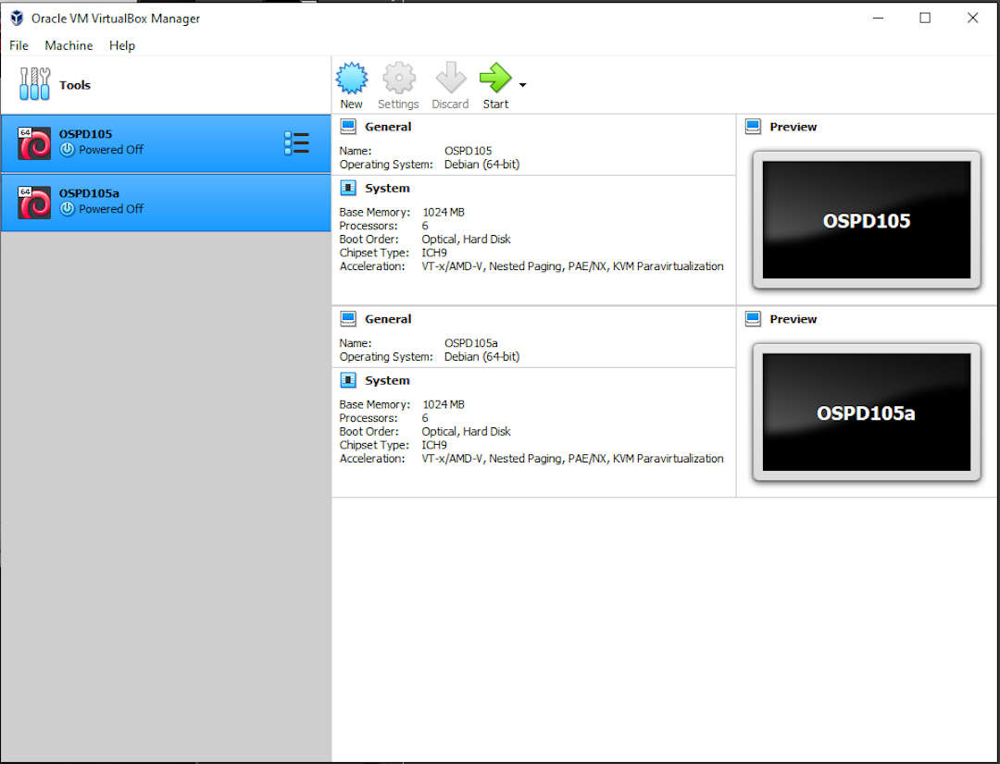
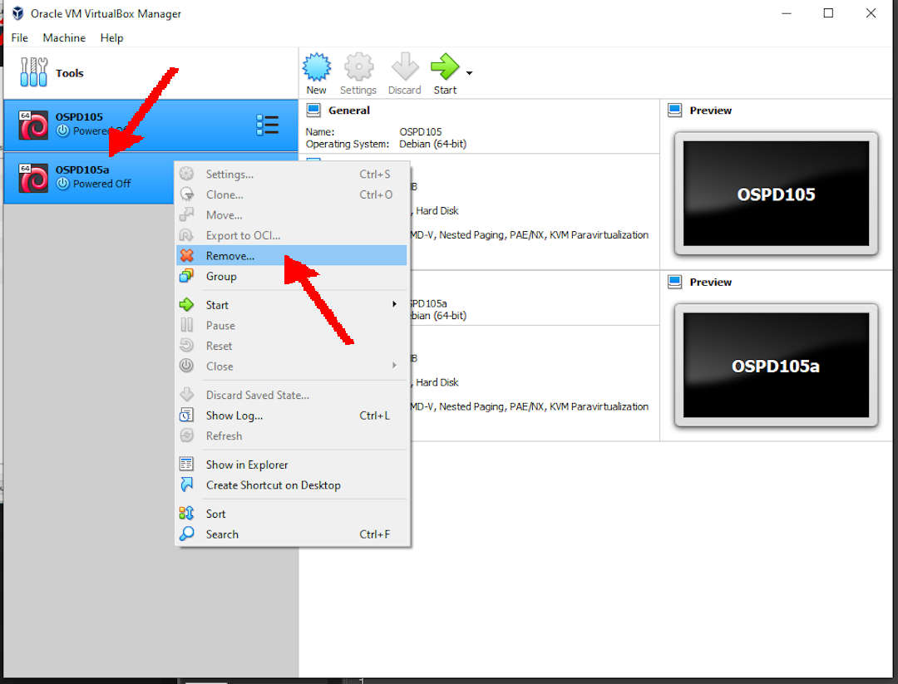
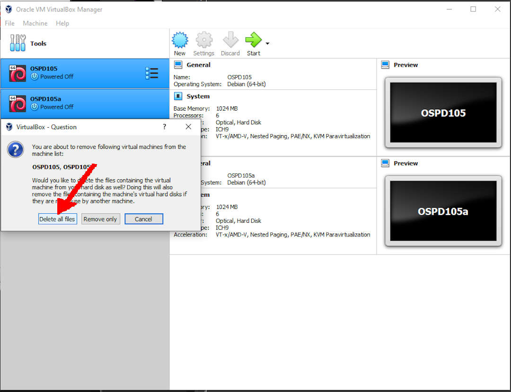
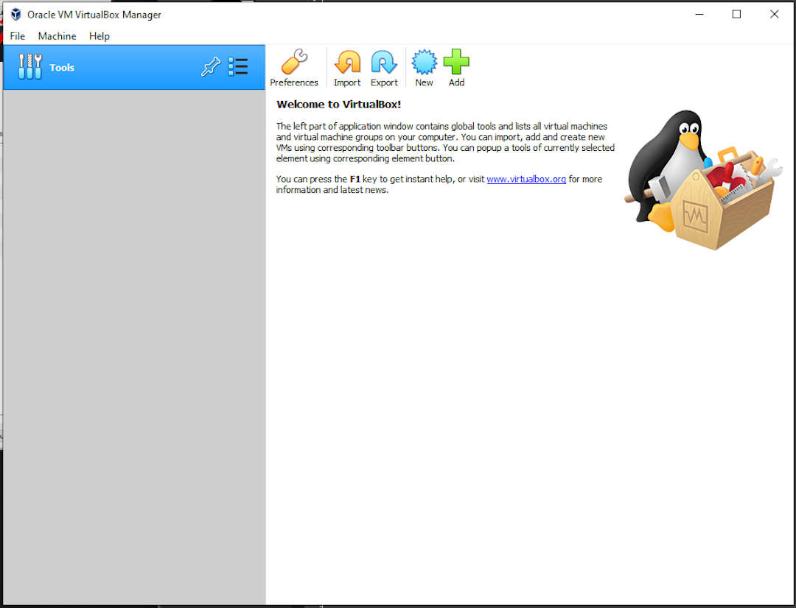

---
---

[HOME](index.md)
[ABOUT](README.md)
[WEB](https://osp4diss.vlsm.org/)
[GITHUB](https://github.com/UI-FASILKOM-OS/osp4diss/)
[TOP](#)
[BOTTOM](#endofpage)
[PREV](ExportImportGuests.md)
[NEXT](index.md)

# Deleting Debian Guests

## Sometimes you might want to delete your Virtual Guest(s).

### Eg. OSPD105 and OSPD105a

 
## Select and Click Right, then REMOVE

 
## Delete All Files

 
## DONE!

  

[HOME](index.md)
[ABOUT](README.md)
[WEB](https://osp4diss.vlsm.org/)
[GITHUB](https://github.com/UI-FASILKOM-OS/osp4diss/)
[TOP](#)
[BOTTOM](#endofpage)
[PREV](ExportImportGuests.md)
[NEXT](index.md)
 

