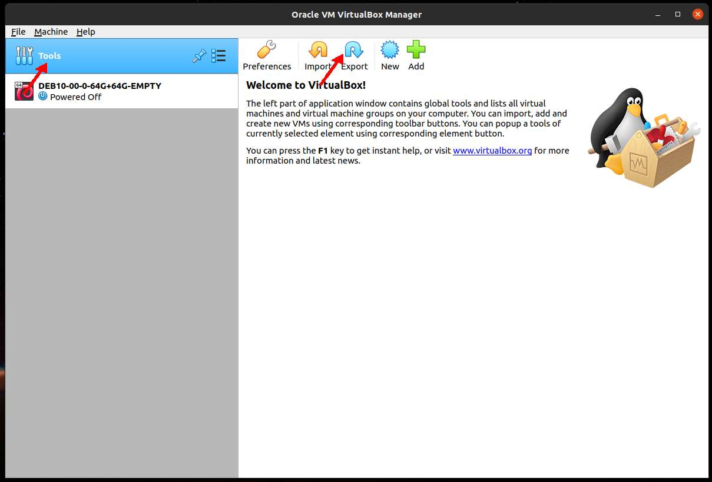
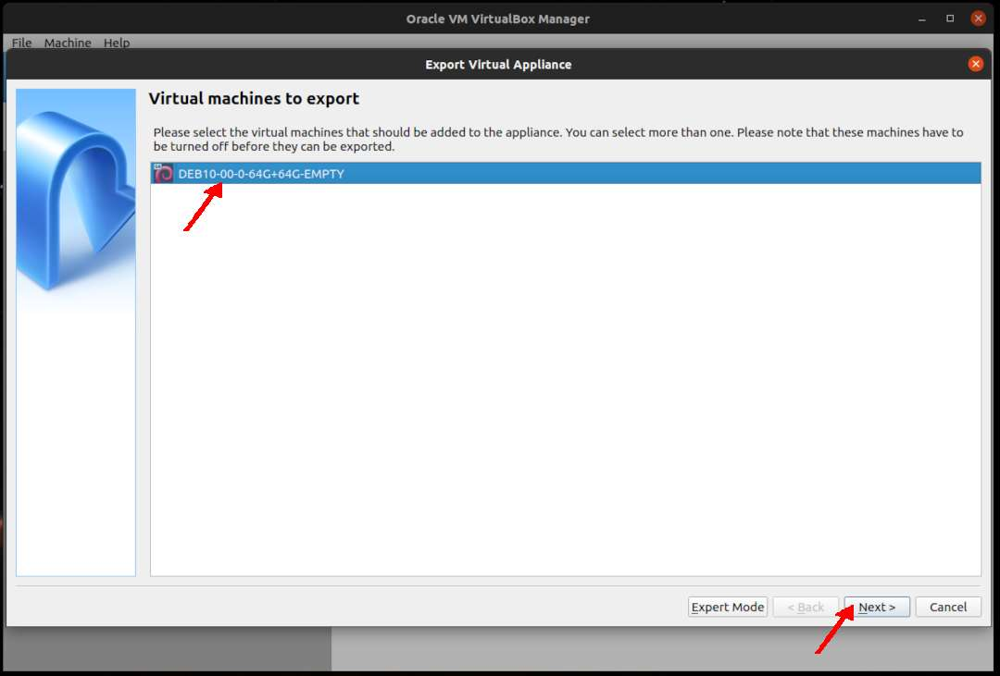
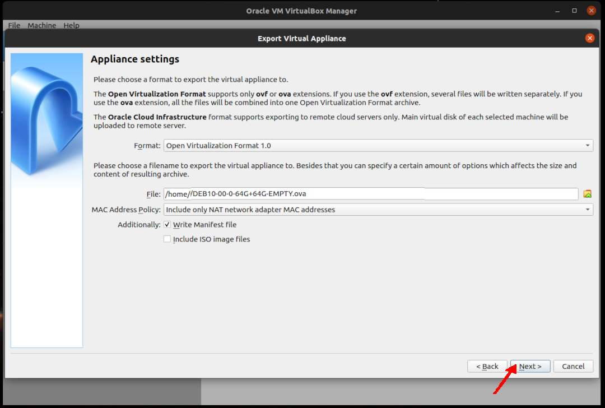
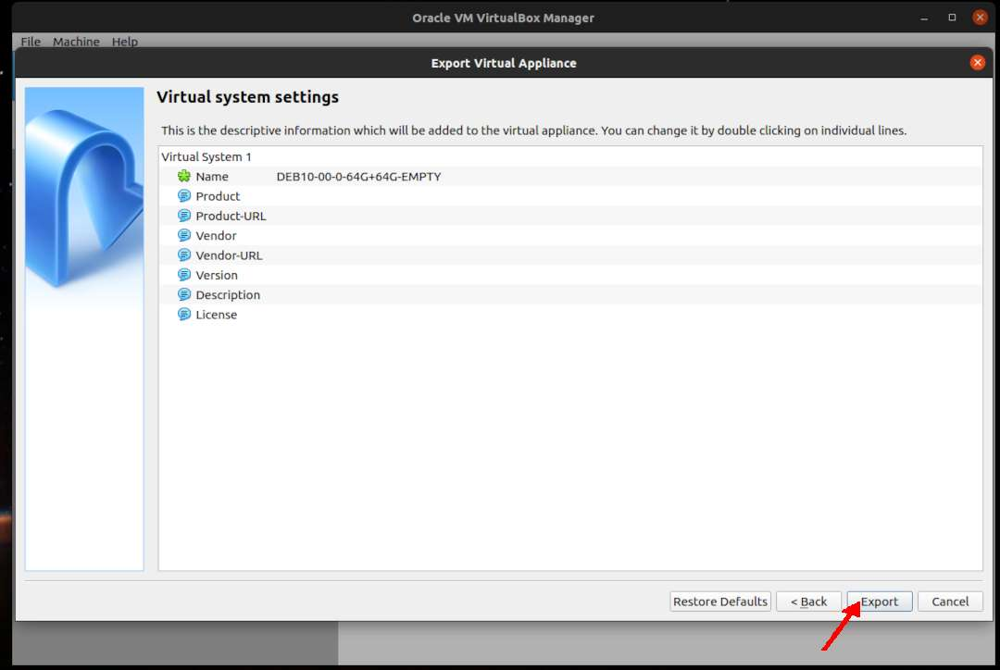
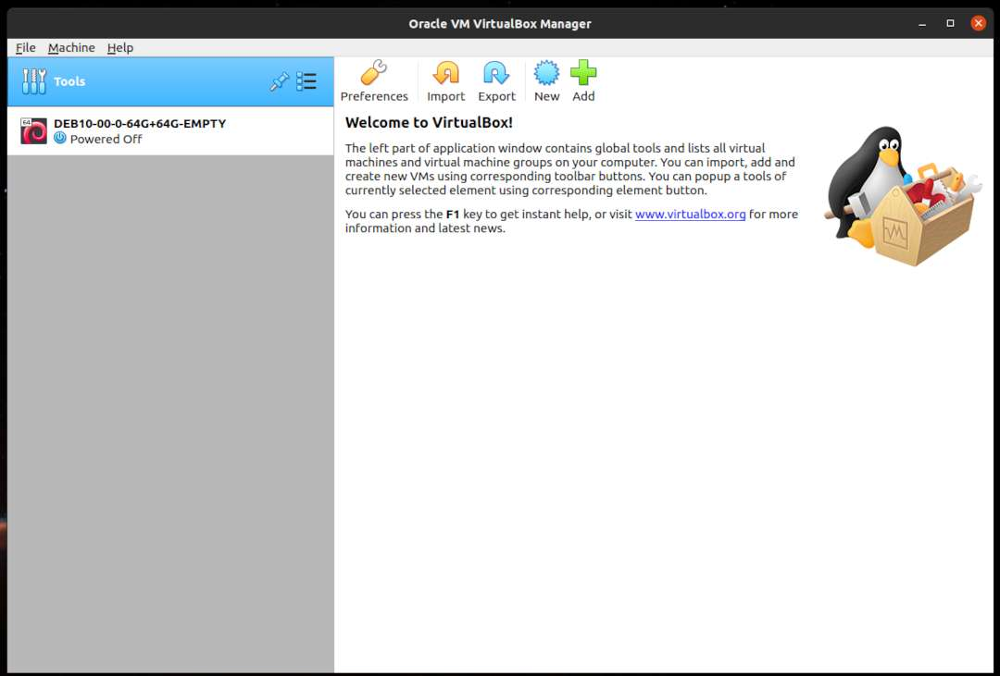

---
---

[HOME](index.md)
[ABOUT](README.md)
[WEB](https://osp4diss.vlsm.org/)
[GITHUB](/https://github.com/os2xx/osp4diss)
[TOP](#)
[BOTTOM](#endofpage)
[PREV](index.md)
[NEXT](DebianGuestImportOva.md)

# Exporting a Debian Guest In OVA Format

## Eg. DEB10-00-0-64G+64G-EMPTY

### (Tools) Export

 
### Virtual Machines To Export: DEB10-00-0-64G+64G-EMPTY

 
### Applience Settings

 
### Virtual System Settings

 
### Export Done (DEB10-00-0-64G+64G-EMPTY)

  

[HOME](index.md)
[ABOUT](README.md)
[WEB](https://osp4diss.vlsm.org/)
[GITHUB](/https://github.com/os2xx/osp4diss)
[TOP](#)
[BOTTOM](#endofpage)
[PREV](index.md)
[NEXT](DebianGuestImportOva.md)
 

