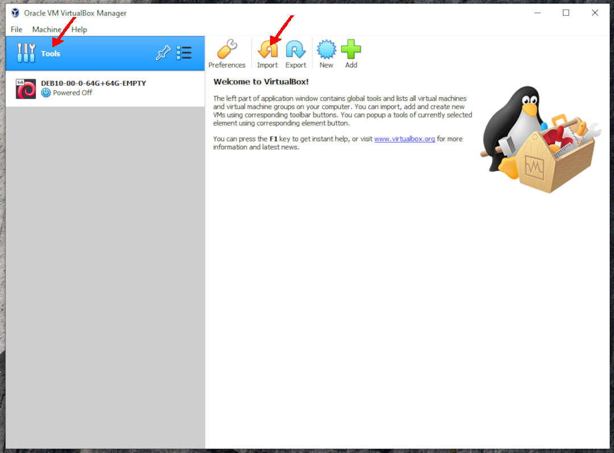

---
---

[HOME](index.md)
[ABOUT](README.md)
[WEB](https://osp4diss.vlsm.org/)
[GITHUB](https://github.com/UI-FASILKOM-OS/osp4diss/)
[TOP](#)
[BOTTOM](#endofpage)
[PREV](DebianGuestExportOva.md)
[NEXT](ExportImportGuests.md)

# Importing a Debian Guest In OVA Format

## Eg. You might want to keep DEB10-00-0-64G+64G-EMPTY as a backup, and using DEB10-00-1-INSTALL for daily usage.

### (Tools) IMPORT

 
### Applience To Import: DEB10-00-0-64G+64G-EMPTY.ova

 
### NEXT

 
### Applience Setting

* Guest Name: DEB10-00-1-INSTALL

 
## Your DEB10-00-1-INSTALL Guest is READY!

  

[HOME](index.md)
[ABOUT](README.md)
[WEB](https://osp4diss.vlsm.org/)
[GITHUB](https://github.com/UI-FASILKOM-OS/osp4diss/)
[TOP](#)
[BOTTOM](#endofpage)
[PREV](DebianGuestExportOva.md)
[NEXT](ExportImportGuests.md)
 

