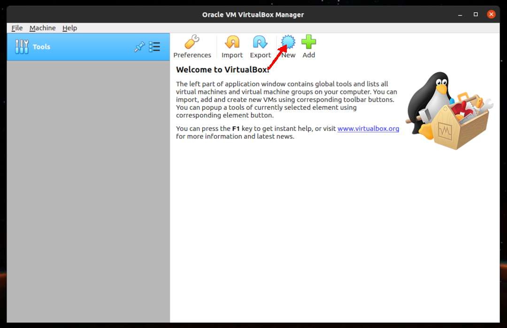
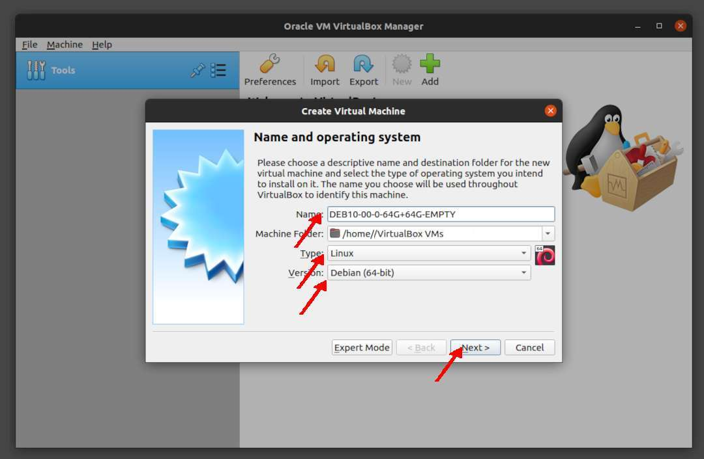
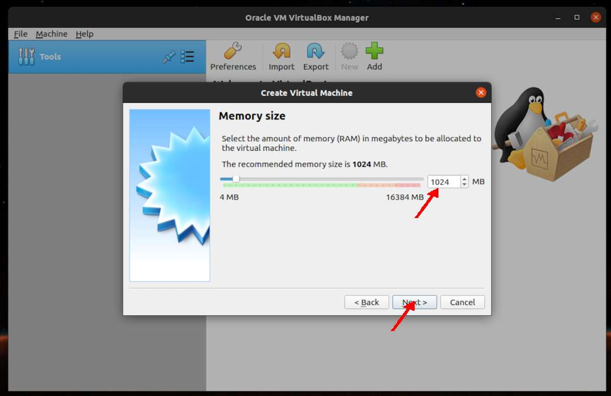
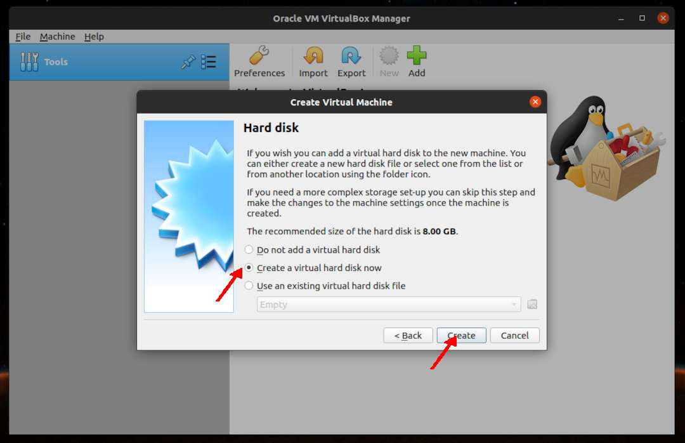
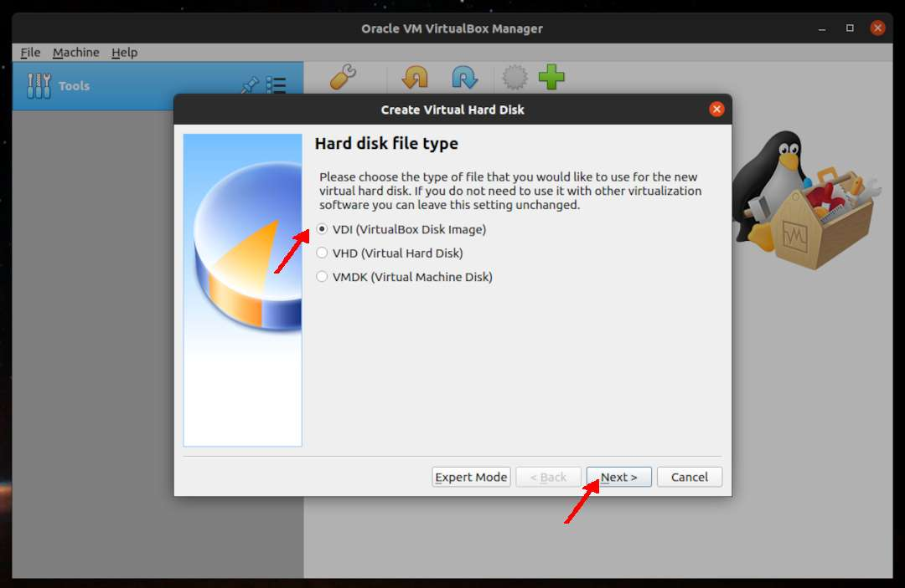
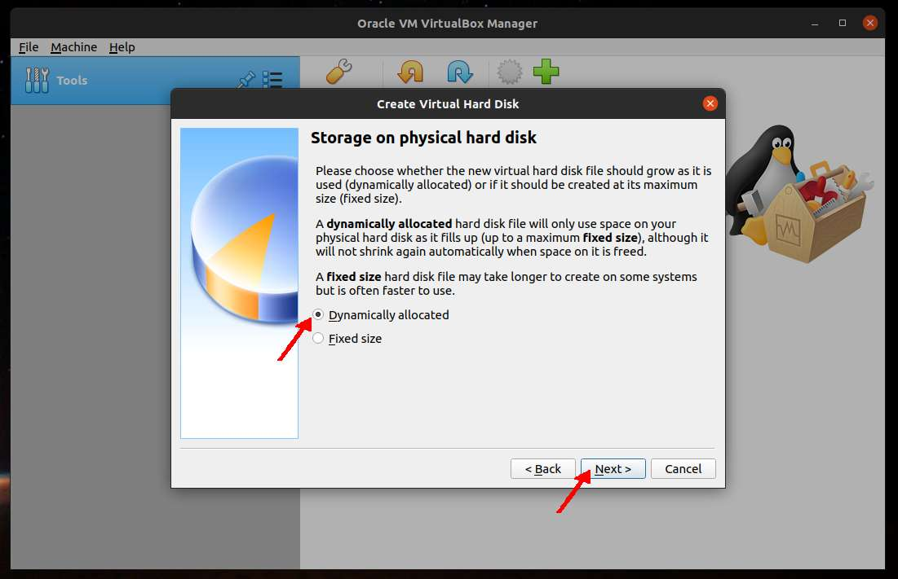
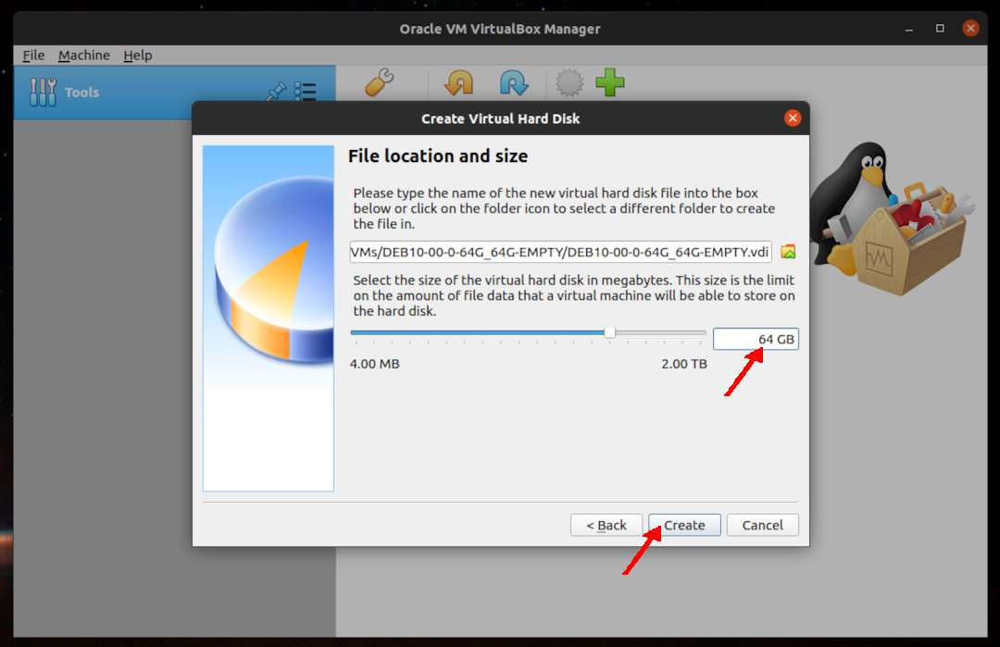

---
---

[HOME](index.md)
[ABOUT](README.md)
[WEB](https://osp4diss.vlsm.org/)
[GITHUB](https://github.com/UI-FASILKOM-OS/osp4diss/)
[TOP](#)
[BOTTOM](#endofpage)
[PREV](index.md)
[NEXT](DebianGuestOnVirtualBox2.md)

# Creating a NEW empty VirtualBox Guest

* You should adjust these following according to your own belief and faith.
  * Name: **DEB10-00-0-64G+64G-EMPTY** (your may choose a different guest name).
  * Processors (Cores): 2 (check your CPU!)
  * Memory = 1024 MB (512MB is OK too!)
  * Storage1 = 64 GB (dynamically allocated)
  * Storage2 = 64 GB (dynamically allocated)
  * SSH: NAT  from host  (127.0.0.1 port 6022) to guest (10.0.2.15 port 22)
  * Jekyll: NAT from host (127.0.0.1 port 5000) to guest (10.0.2.15 port 4000)

 
## Click NEW

 
* Name = **DEB10-00-0-64G+64G-EMPTY**
  * Type: Linux
  * Version: Debian (64bit)

 
* Memory size = 1024 MB (But, 512 MB is OK too!)

 
* Create a Virtual Hard Disk

 
* Hard Disk type: VDI

 
* Storage: Dynamically Allocated

 
* Storage = 64 GB (dynamically allocated)

  

[HOME](index.md)
[ABOUT](README.md)
[WEB](https://osp4diss.vlsm.org/)
[GITHUB](https://github.com/UI-FASILKOM-OS/osp4diss/)
[TOP](#)
[BOTTOM](#endofpage)
[PREV](index.md)
[NEXT](DebianGuestOnVirtualBox2.md)

