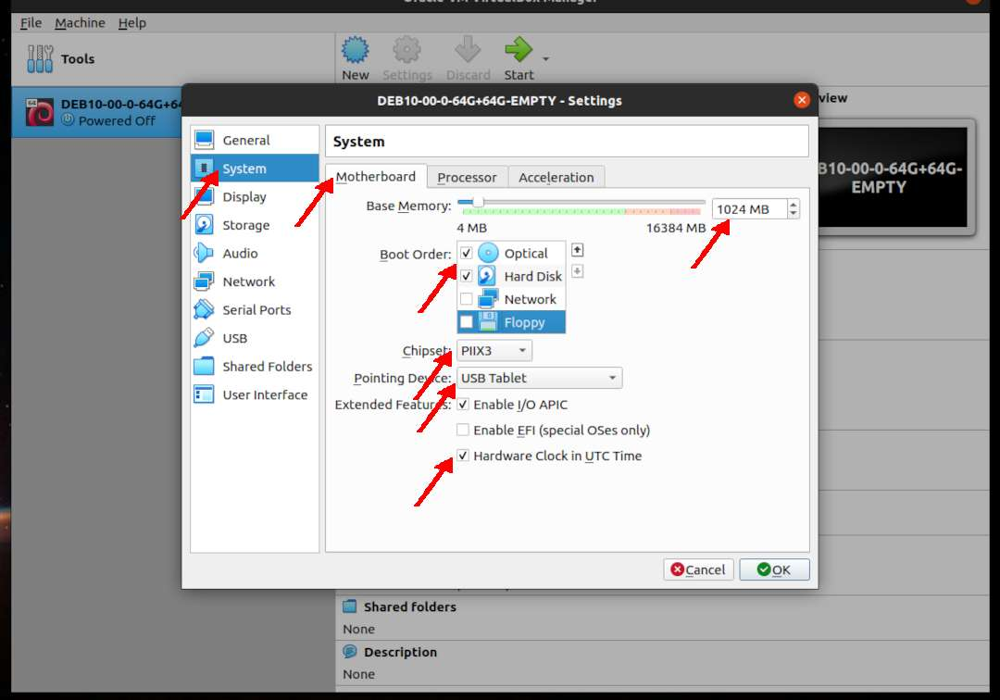
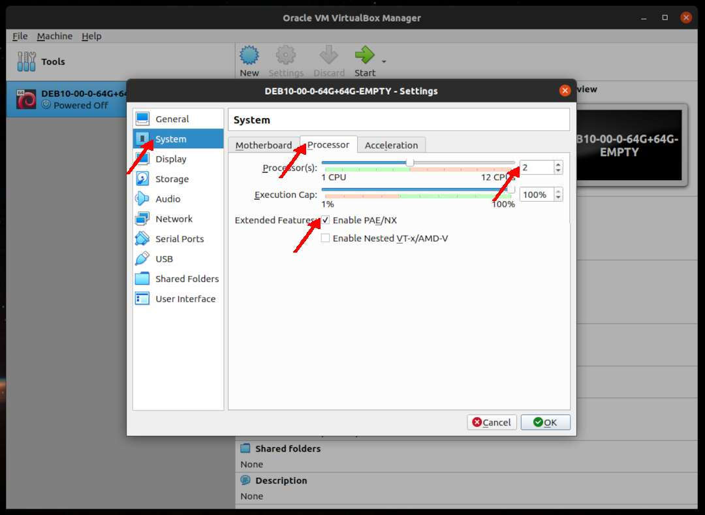
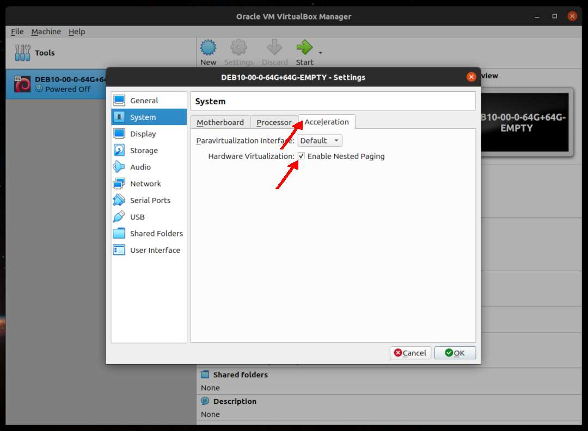

---
---

[HOME](index.md)
[ABOUT](README.md)
[WEB](https://osp4diss.vlsm.org/)
[GITHUB](https://github.com/UI-FASILKOM-OS/osp4diss/)
[TOP](#)
[BOTTOM](#endofpage)
[PREV](DebianGuestOnVirtualBox2.md)
[NEXT](DebianGuestOnVirtualBox4.md)

# New VirtualBox Guest: System

* Example **DEB10-00-0-64G+64G-EMPTY**

## Click SETTING

 
## System: Motherboard

* E.g.: Base Memory = 1024MB

 
## System: Processors (2)

* How many cores are available?
  * E.g.: Two (2) Cores

 
## System: Acceleration

  

[HOME](index.md)
[ABOUT](README.md)
[WEB](https://osp4diss.vlsm.org/)
[GITHUB](https://github.com/UI-FASILKOM-OS/osp4diss/)
[TOP](#)
[BOTTOM](#endofpage)
[PREV](DebianGuestOnVirtualBox2.md)
[NEXT](DebianGuestOnVirtualBox4.md)

