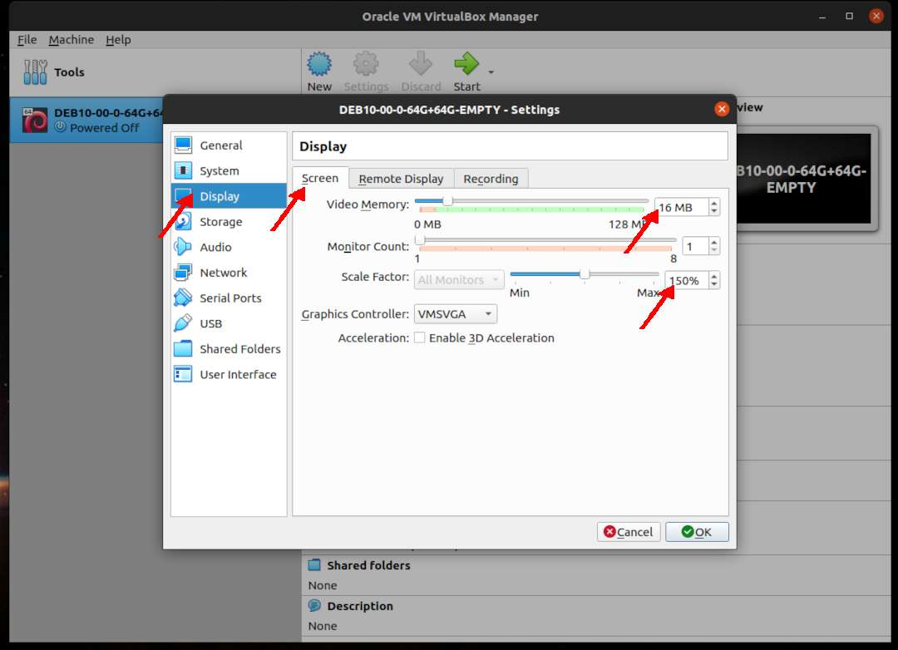

---
---

[HOME](index.md)
[ABOUT](README.md)
[WEB](https://osp4diss.vlsm.org/)
[GITHUB](https://github.com/UI-FASILKOM-OS/osp4diss/)
[TOP](#)
[BOTTOM](#endofpage)
[PREV](DebianGuestOnVirtualBox3.md)
[NEXT](DebianGuestOnVirtualBox5.md)

# New VirtualBox Guest: Display

* Example **DEB10-00-0-64G+64G-EMPTY**

### Click SETTING

 
### Display: Screen

* Scale Factor: 150%
  * Adjust the screen size if it is too small or too large.

  

[HOME](index.md)
[ABOUT](README.md)
[WEB](https://osp4diss.vlsm.org/)
[GITHUB](https://github.com/UI-FASILKOM-OS/osp4diss/)
[TOP](#)
[BOTTOM](#endofpage)
[PREV](DebianGuestOnVirtualBox3.md)
[NEXT](DebianGuestOnVirtualBox5.md)

