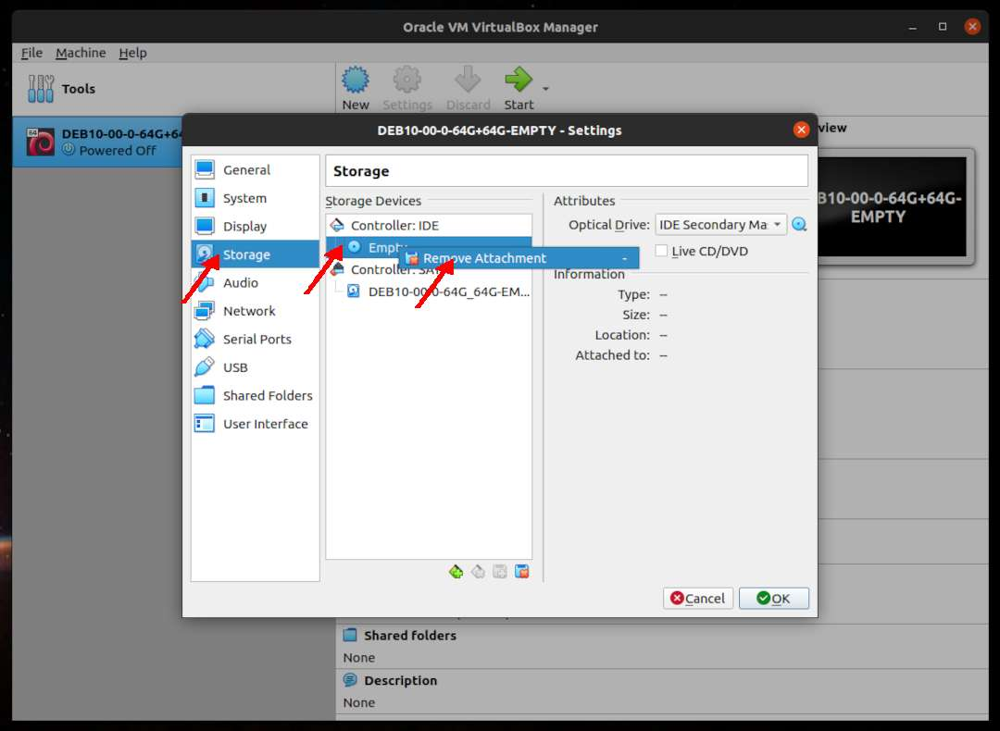
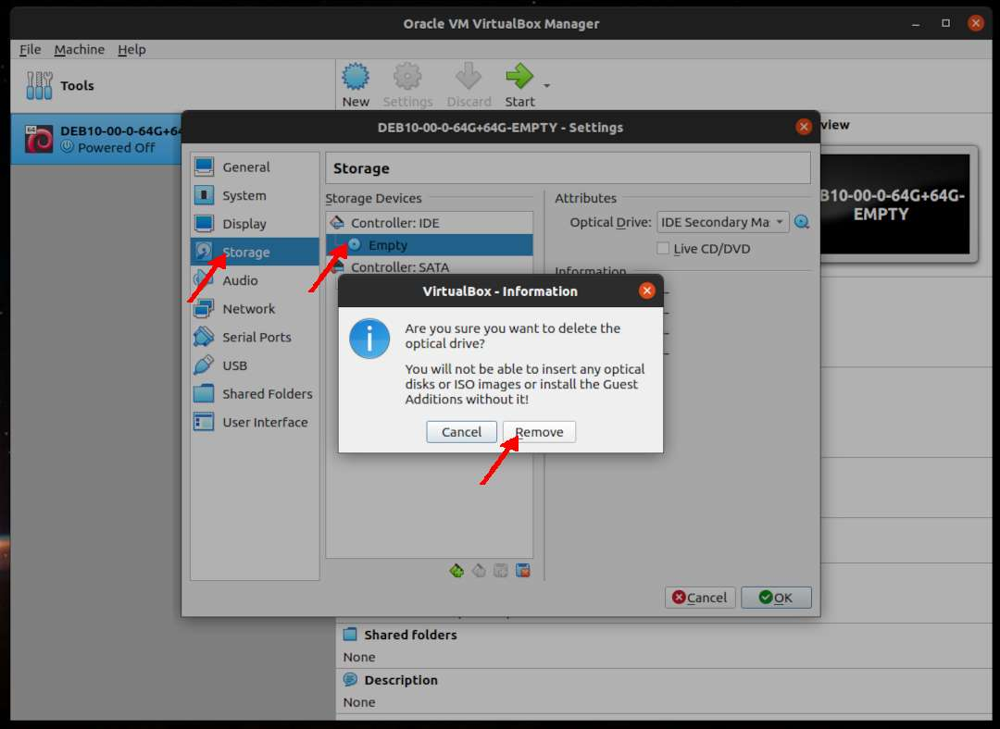
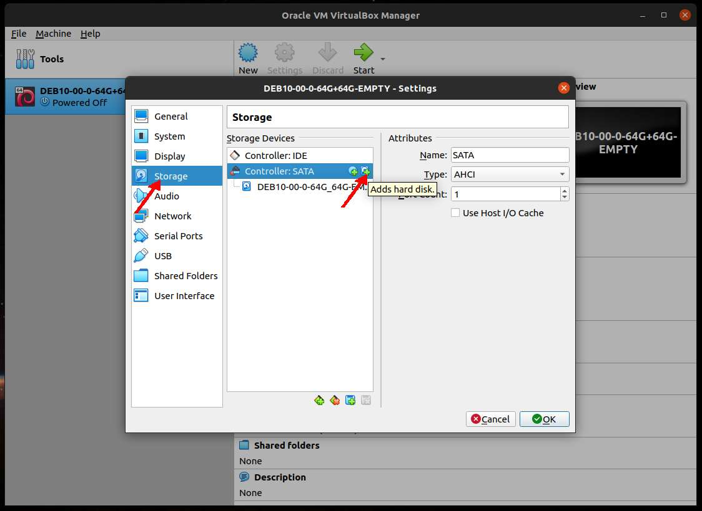
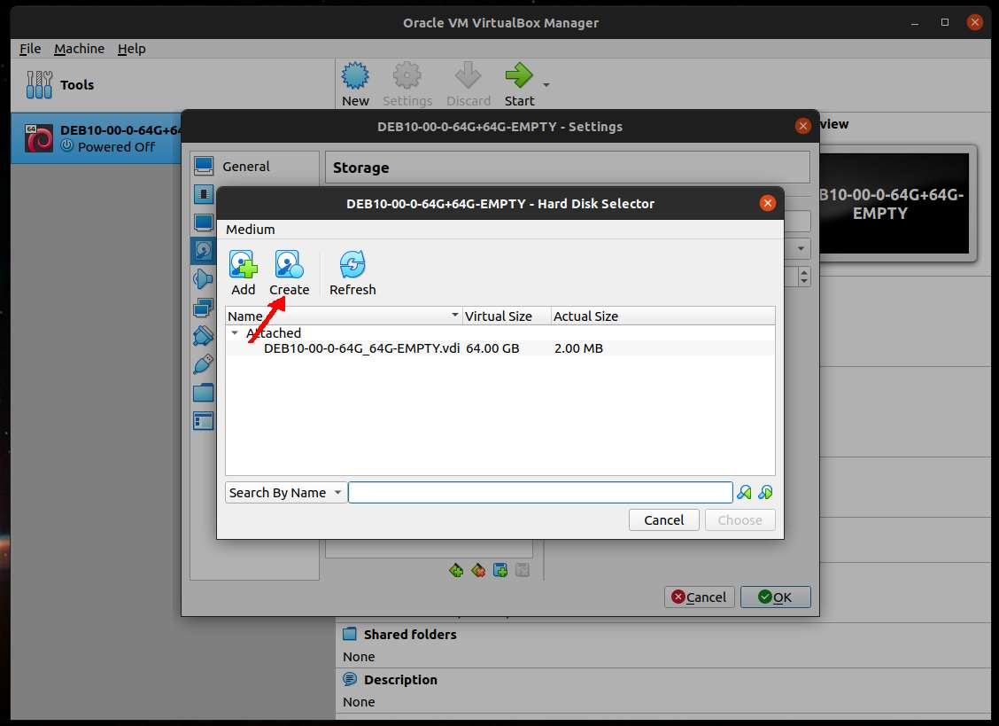
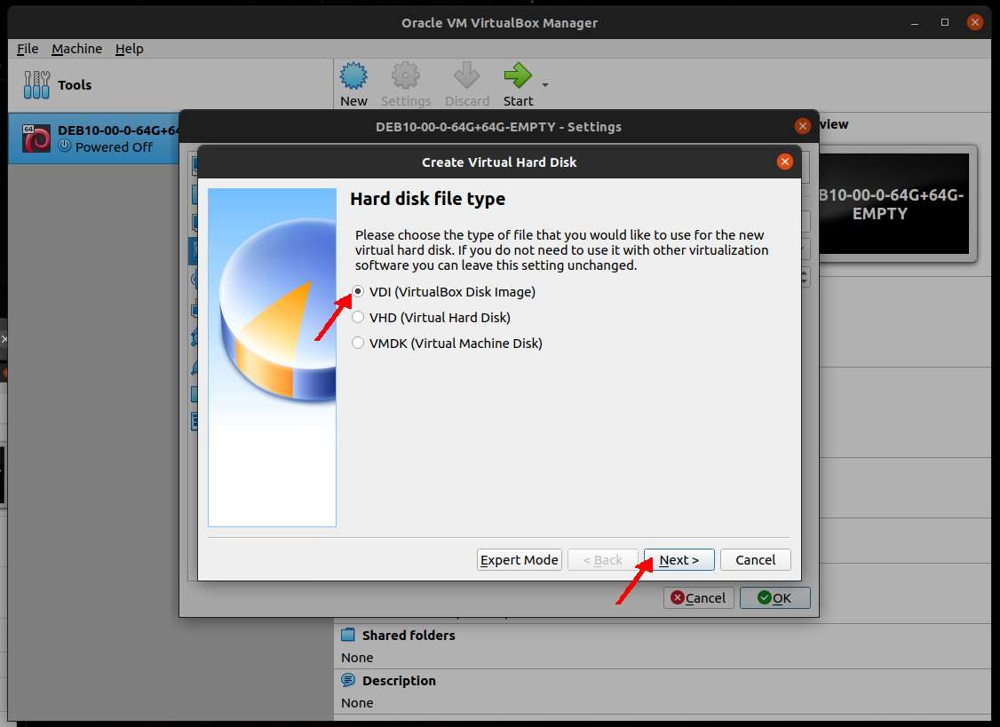
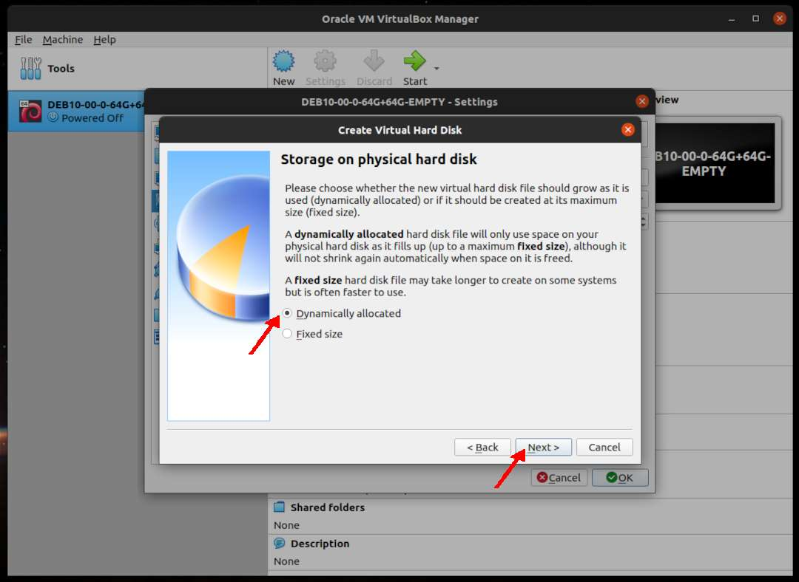
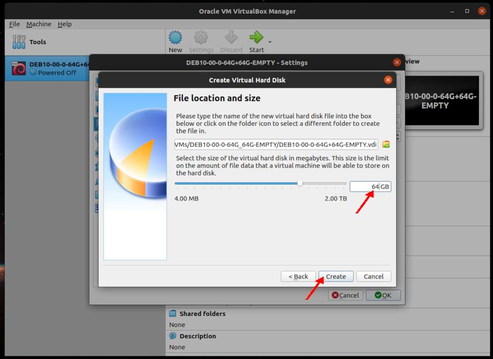
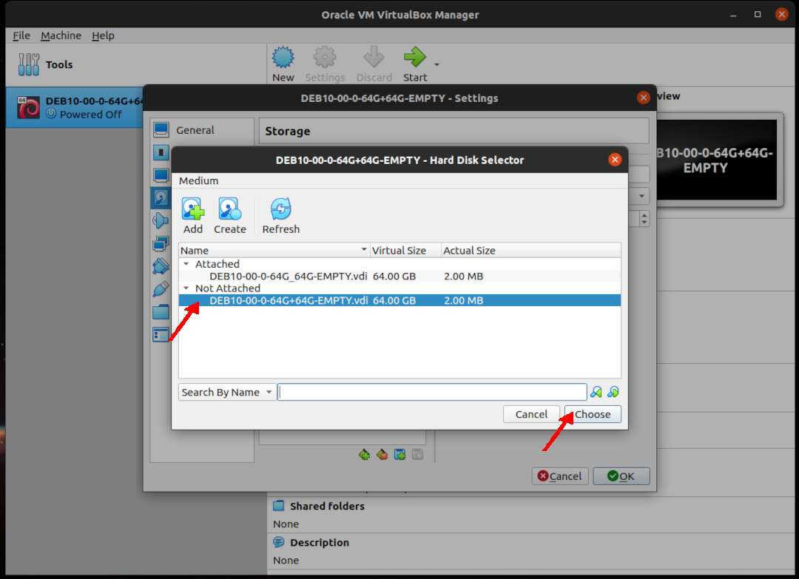
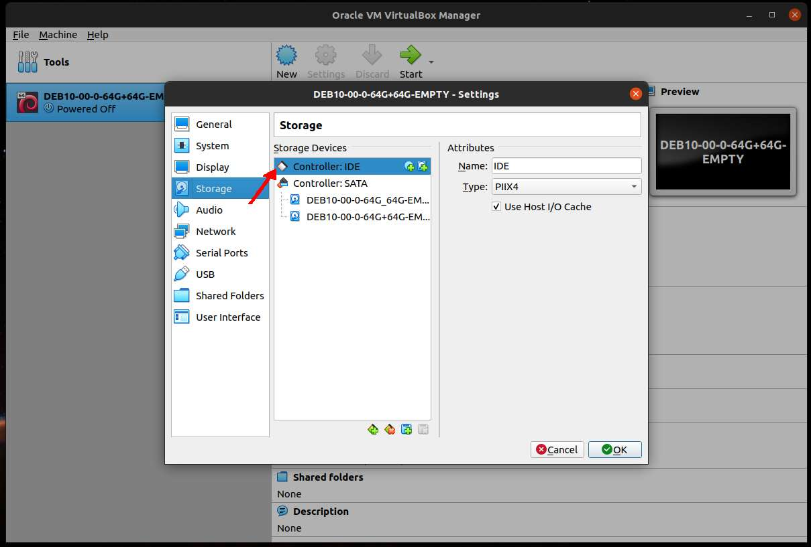
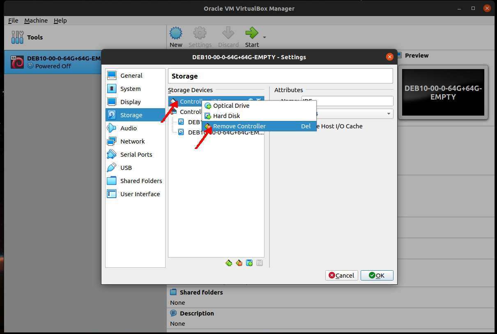

---
---

[HOME](index.md)
[ABOUT](README.md)
[WEB](https://osp4diss.vlsm.org/)
[GITHUB](https://github.com/UI-FASILKOM-OS/osp4diss/)
[TOP](#)
[BOTTOM](#endofpage)
[PREV](DebianGuestOnVirtualBox4.md)
[NEXT](DebianGuestOnVirtualBox6.md)

# New VirtualBox Guest: Storage

* Example **DEB10-00-0-64G+64G-EMPTY**

### Click SETTING

 
### Storage: Remove Empty IDE

* RIGHT click (Remove Attachment)

* Remove Empty 

 
### Storage: SATA: Adds Hard disk

* Create a new disk

* Hard disk type: VDI

* Dynamically Allocated

* (Second) Disk Storage: 64 GB

* Choose (64 GB Storage)

* Sellect IDE Controller

* Remove IDE Controller

  

[HOME](index.md)
[ABOUT](README.md)
[WEB](https://osp4diss.vlsm.org/)
[GITHUB](https://github.com/UI-FASILKOM-OS/osp4diss/)
[TOP](#)
[BOTTOM](#endofpage)
[PREV](DebianGuestOnVirtualBox4.md)
[NEXT](DebianGuestOnVirtualBox6.md)

