---
---

[HOME](index.md)
[ABOUT](README.md)
[WEB](https://osp4diss.vlsm.org/)
[GITHUB](/https://github.com/os2xx/osp4diss)
[TOP](#)
[BOTTOM](#endofpage)
[PREV](DebianGuestOnVirtualBox4.md)
[NEXT](DebianGuestOnVirtualBox6.md)

# New VirtualBox Guest: Storage

* Example **DEB11-01**

### Click SETTING

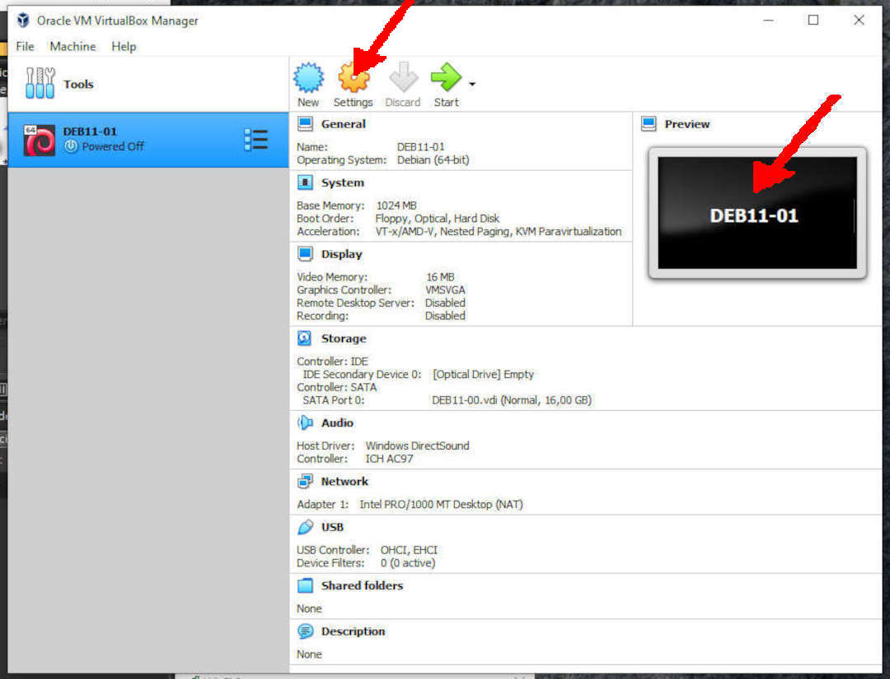

 
### Storage: Remove Empty IDE

* RIGHT click (Remove Attachment)

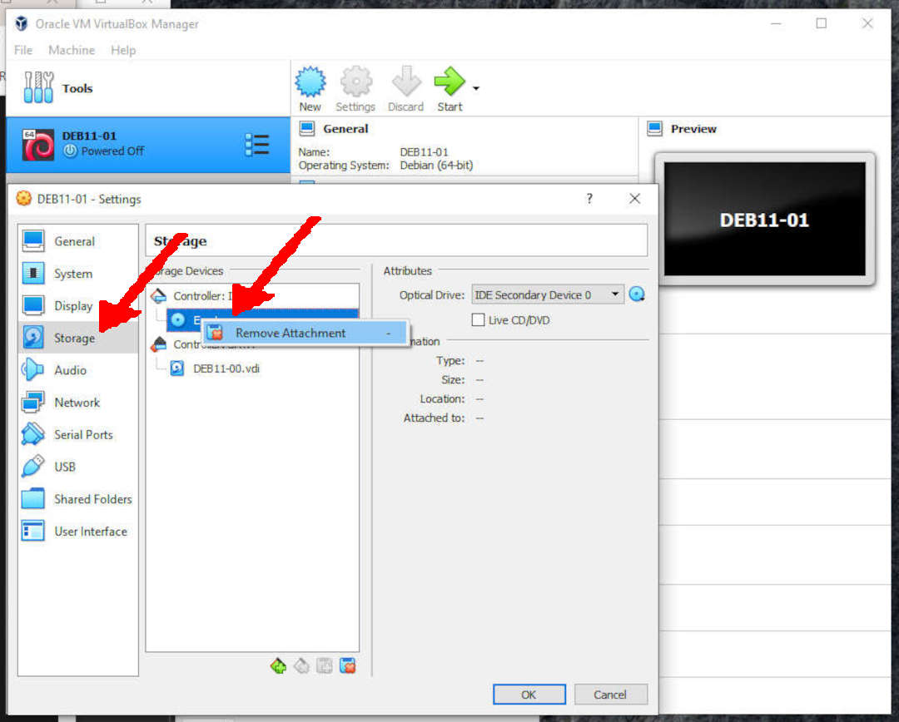

* Remove Empty 

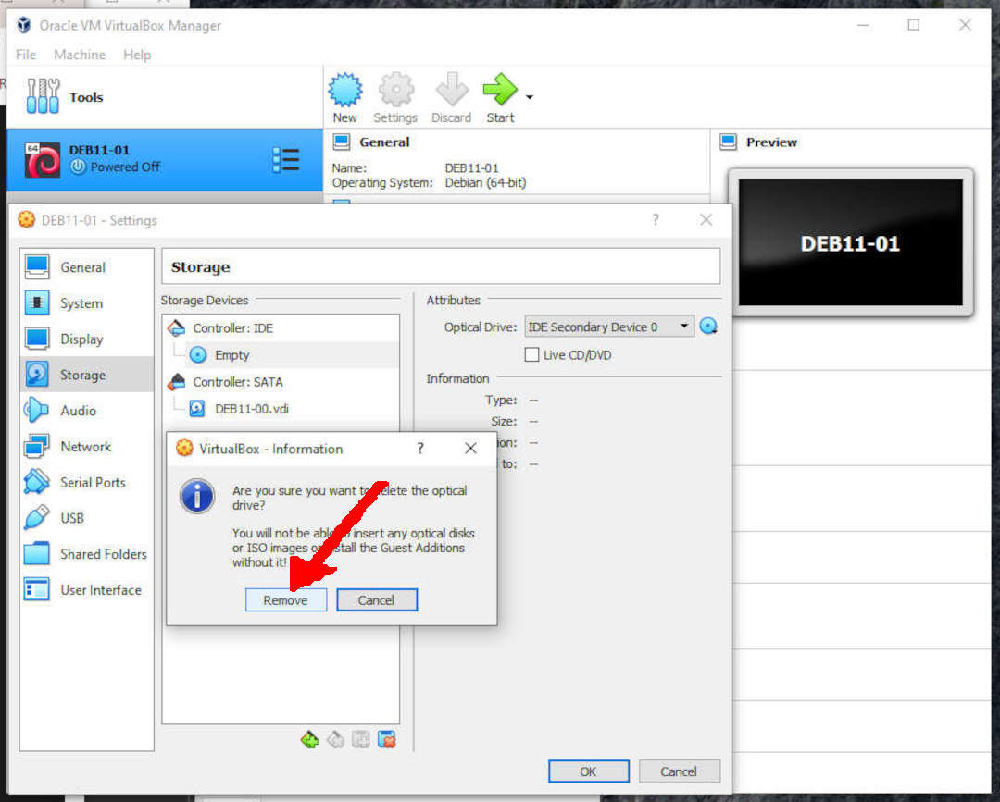

* Remove IDE Controller

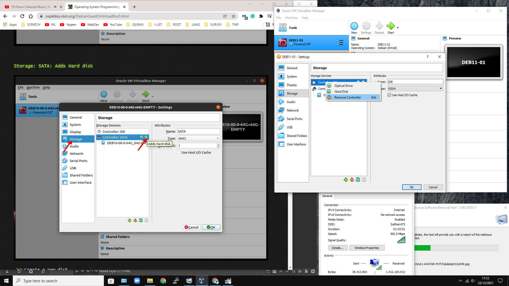

 
### Storage: SATA: Adds Hard disk

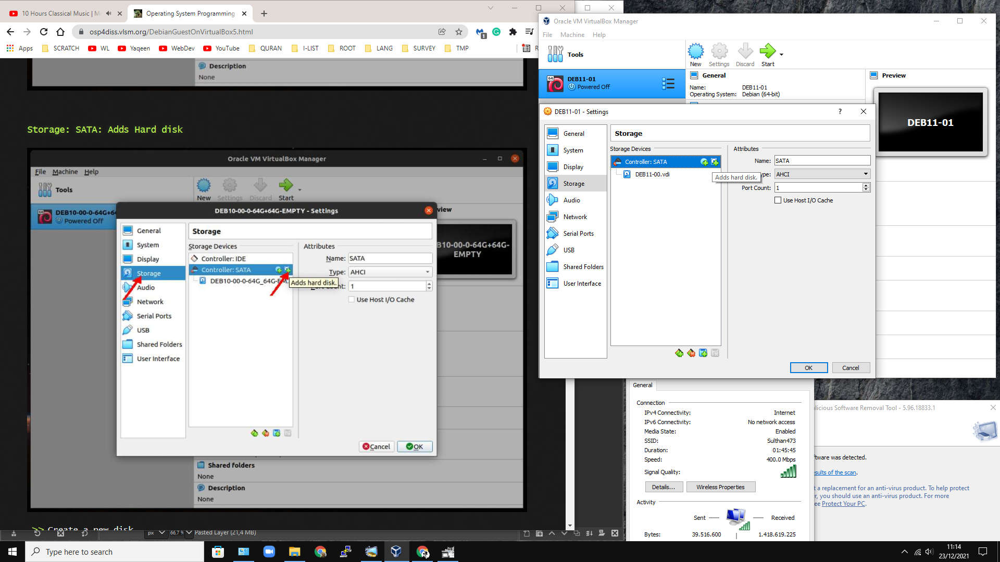

* Create a new disk

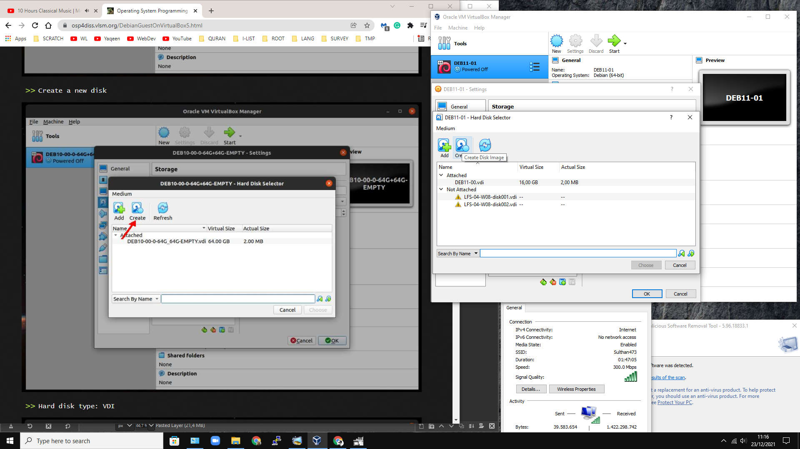

* Hard disk type: VDI

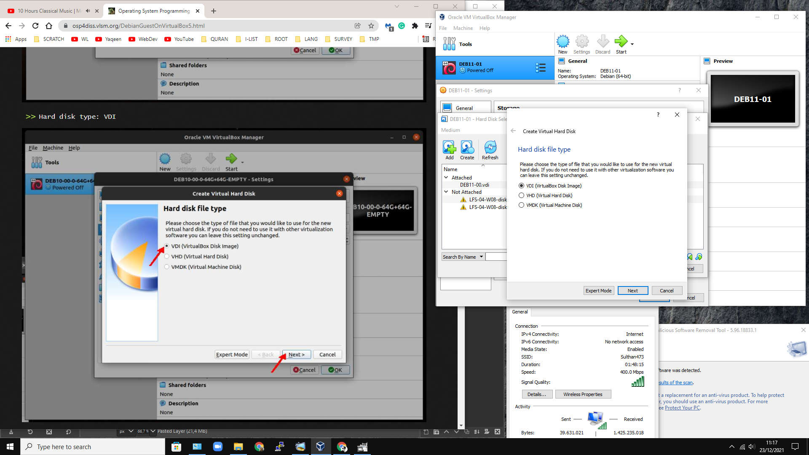

* Dynamically Allocated

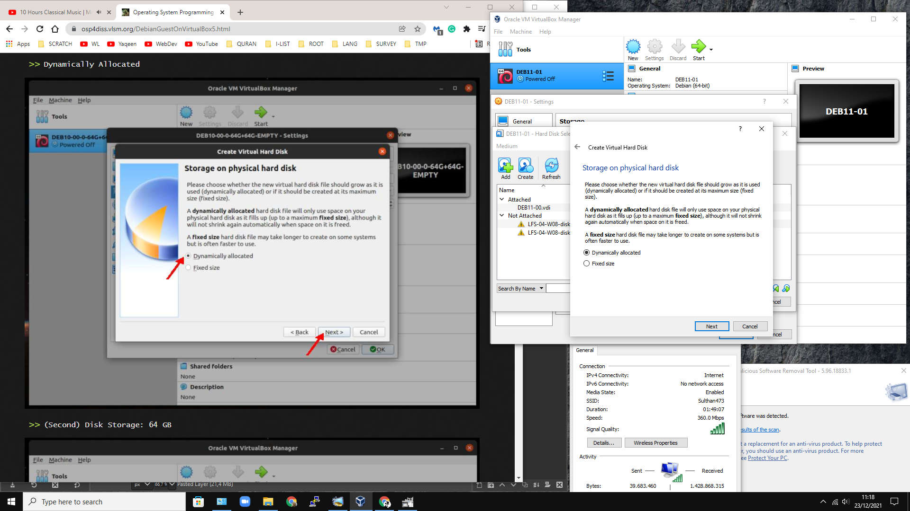

* (Second) Disk Storage: 32 GB

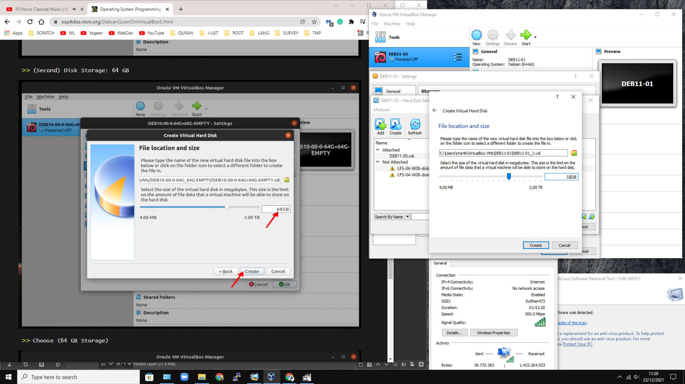

* Choose (32 GB Storage)

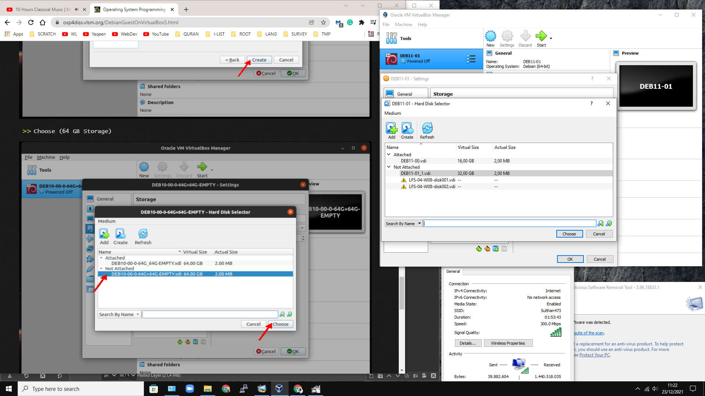

* Done (SATA only)

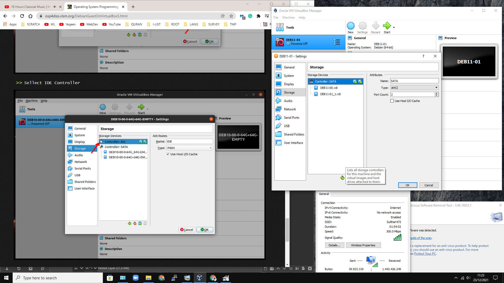

  

[HOME](index.md)
[ABOUT](README.md)
[WEB](https://osp4diss.vlsm.org/)
[GITHUB](/https://github.com/os2xx/osp4diss)
[TOP](#)
[BOTTOM](#endofpage)
[PREV](DebianGuestOnVirtualBox4.md)
[NEXT](DebianGuestOnVirtualBox6.md)

