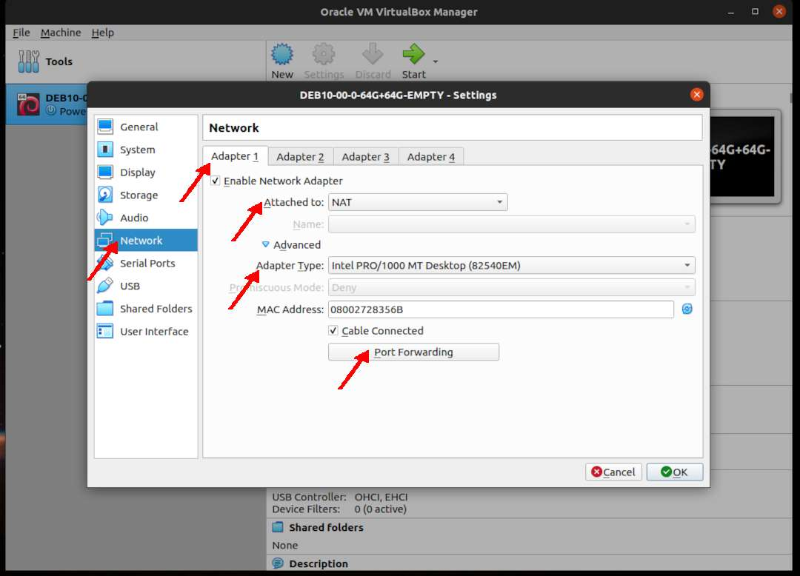
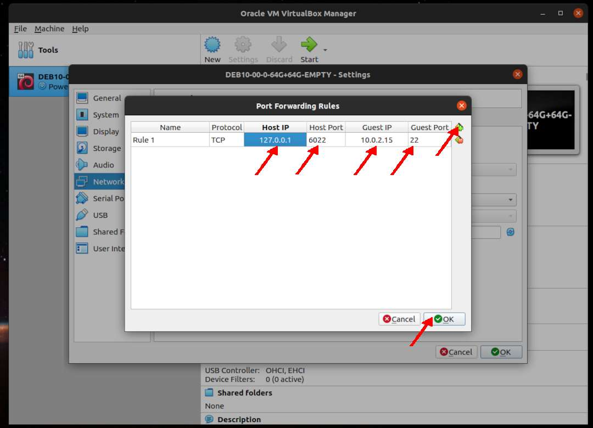
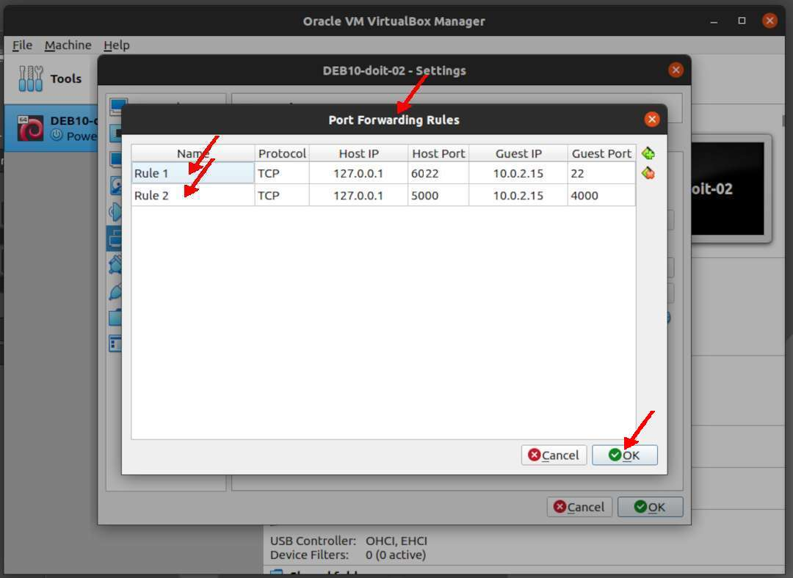
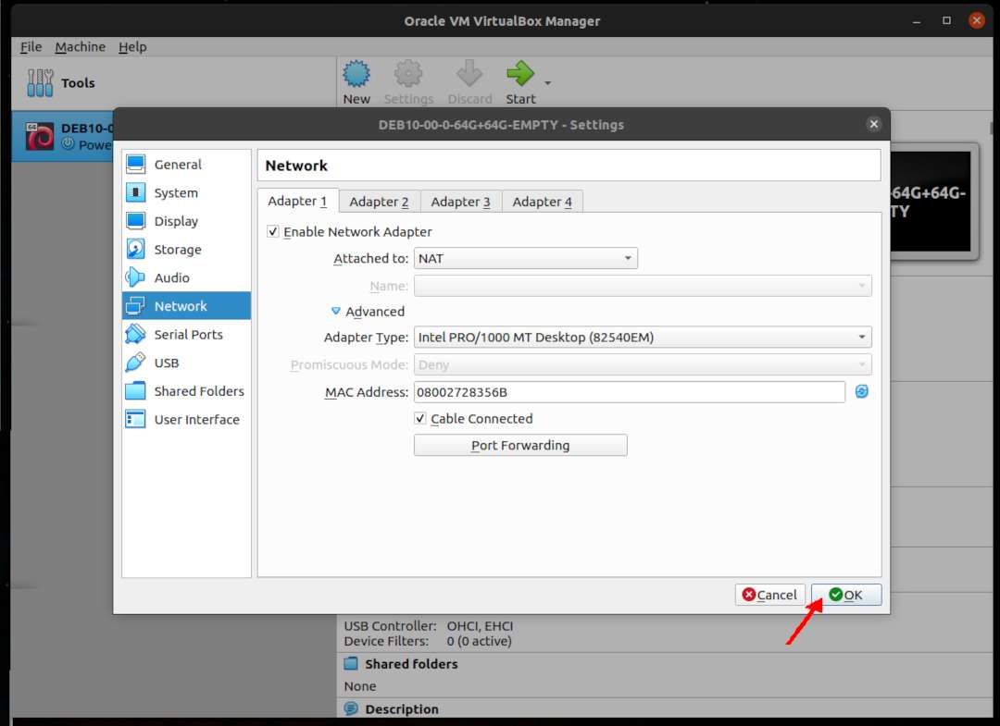

---
---

[HOME](index.md)
[ABOUT](README.md)
[WEB](https://osp4diss.vlsm.org/)
[GITHUB](/https://github.com/os2xx/osp4diss)
[TOP](#)
[BOTTOM](#endofpage)
[PREV](DebianGuestOnVirtualBox6.md)
[NEXT](DebianISOImage.md)

# New VirtualBox Guest: Network

* Example **DEB10-00-0-64G+64G-EMPTY**
* SSH: Forward from host 127.0.0.1:6022 to guest 10.0.2.15:22
* Jekyll: Forward from host 127.0.0.1:5000 to guest 10.0.2.15:4000 (Jekyll)
* You might want to use other settings

### Click SETTING

 
### Network: Adapter 1 (NAT): Port Forwarding

* Click Port Forwarding

* **ADD (+)** Forward ssh from host 127.0.0.1:6022 to guest 10.0.2.15:22 (SSH)

* **ADD (+)** Forward ssh from host 127.0.0.1:5000 to guest 10.0.2.15:4000 (Jekyll)

 
### Network: Adapter 1 (NAT) --- DONE

  

[HOME](index.md)
[ABOUT](README.md)
[WEB](https://osp4diss.vlsm.org/)
[GITHUB](/https://github.com/os2xx/osp4diss)
[TOP](#)
[BOTTOM](#endofpage)
[PREV](DebianGuestOnVirtualBox6.md)
[NEXT](DebianISOImage.md)

