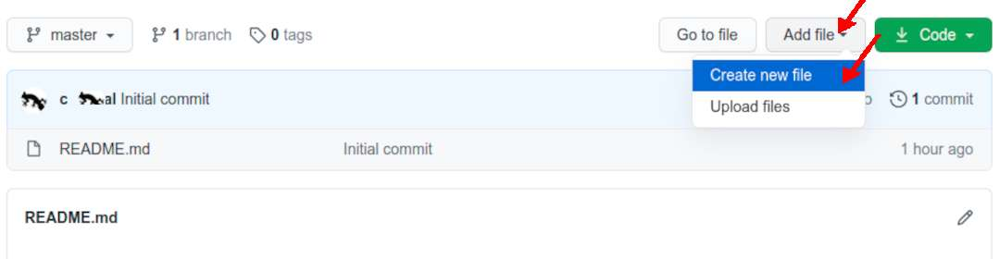
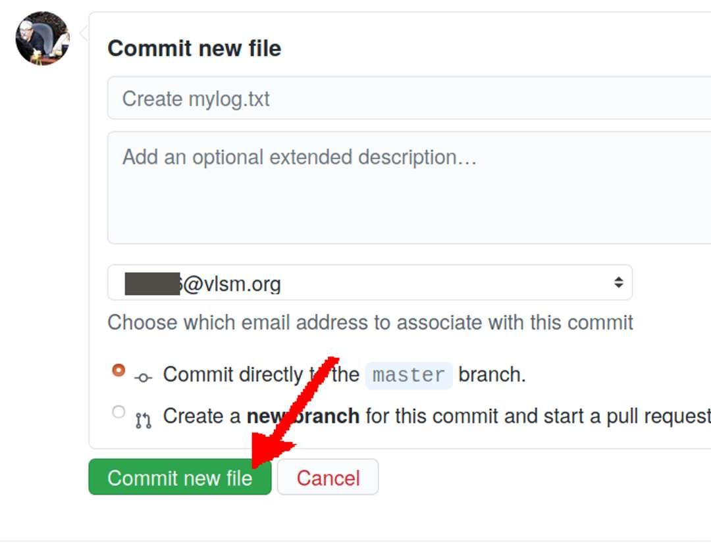

---
---
[HOME](index.md)
[ABOUT](README.md)
[WEB](https://osp4diss.vlsm.org/)
[GITHUB](https://github.com/os2xx/osp4diss/)
[TOP](#)
[BOTTOM](#endofpage)
[PREV](S00-01.md)
[NEXT](S00-03.md)

# SP Week 00 Assignment #2: "TXT/mylog.txt"

## Start Week 00 Log

* See <https://osp4diss.vlsm.org/ETC/logCodes.txt>

```
# REV06 Wed 07 Jul 2021 20:15:07 WIB
# https://osp4diss.vlsm.org/ETC/logCodes.txt
# ZCZC WEEK# MINUTES LogCode Description

L00 General, etc.
L01 SCELE/Discord related
L02 ZOOM meetings related
L03 GitHub related
L04 GitHub Pages related
L05 Quiz related
L06 References/Books/Documents/GSGS related
L07 Demo related
L08 AsDos: asking, etc.
L09 Assignment in General
L10 Assignment #00
L11 Assignment #01
L12 Assignment #02
L13 Assignment #03
L14 Assignment #04
L15 Assignment #05
L16 Assignment #06
L17 Assignment #07
L18 Assignment #08
L19 Assignment #09
L20 Assignment #10
L21 Trying something
L22 Quiz
L23 Linux CLI including tar, etc.
(...)
L86 House chore, including helping mom, pap, uncle, aunty, jaga warung, jualan kue, etc.
L87 Else that is not related with this Operating Systems class.
L99 Other (...)

```

<br id="idx01"><br>
## Add file --> Create new file

* <span style="color:red; font-weight:bold; font-size:larger;">This 
  following is an example from the previous year (os212)</span>



<br id="idx02"><br>
## Folder/File: "TXT/mylog.txt"

* <span style="color:red; font-weight:bold; font-size:larger;">This 
  following is an example from the previous year (os212)</span>


<br id="idx03"><br>
## Commit a new file



<br id="endofpage"><br>
[HOME](index.md)
[ABOUT](README.md)
[WEB](https://osp4diss.vlsm.org/)
[GITHUB](https://github.com/os2xx/osp4diss)
[TOP](#)
[BOTTOM](#endofpage)
[PREV](S00-01.md)
[NEXT](S00-03.md)
<br>

