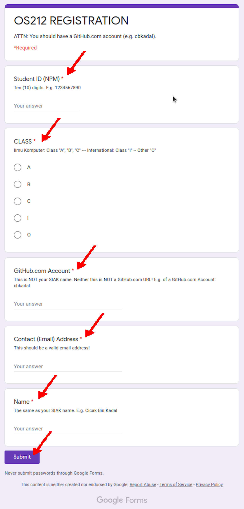

---
---
[HOME](index.md)
[ABOUT](README.md)
[WEB](https://osp4diss.vlsm.org/)
[GITHUB](https://github.com/os2xx/osp4diss/)
[TOP](#)
[BOTTOM](#endofpage)
[PREV](S00-03.md)
[NEXT](S00-05.md)

# SP Week 00 Assignment #4: Course Registration

* You should have a [GitHub.com](https://github.com/) account.
* First,
  you need to log in (login) with your university SSO account by visiting:
  <https://accounts.google.com/> (SSO UI).
* Next, visit the Google Form 
  ([see SCELE](https://scele.cs.ui.ac.id/mod/forum/discuss.php?d=34802)) 
  and fill the following information into the Google Form:
  * Student ID (NPM)
  * Class
    * This semester, there is only class "A".
  * GitHub.com Account
    * GitHub Account example: "cbkadal".
    * "github.com/cbkadal/" is not a GitHub account.
  * Email contact
    * Fill in with the email address that you normally use.
  * Your Full (SIAK) Name:
    * Use your SIAK name, NOT your NICK name.
  * If you make a mistake, revisit the Google Form page.

  
## This following is an example from the previous year of os212

  
[HOME](index.md)
[ABOUT](README.md)
[WEB](https://osp4diss.vlsm.org/)
[GITHUB](https://github.com/os2xx/osp4diss)
[TOP](#)
[BOTTOM](#endofpage)
[PREV](S00-03.md)
[NEXT](S00-05.md)
 

