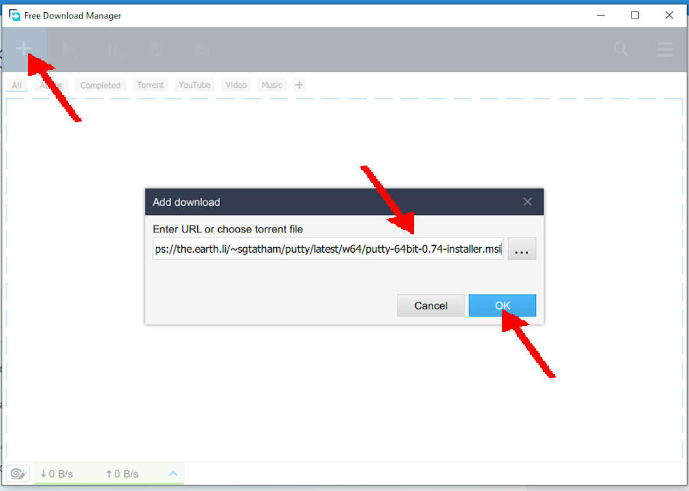
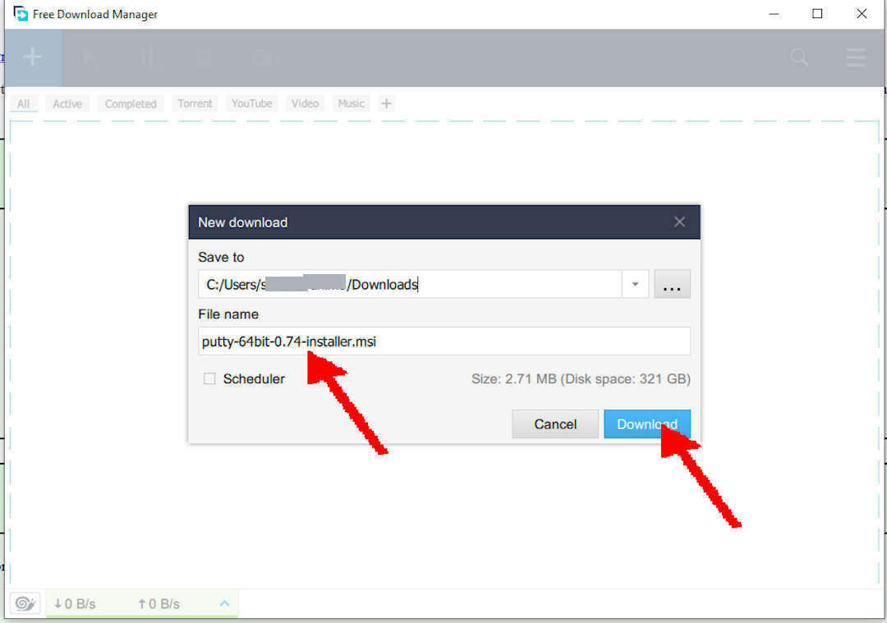
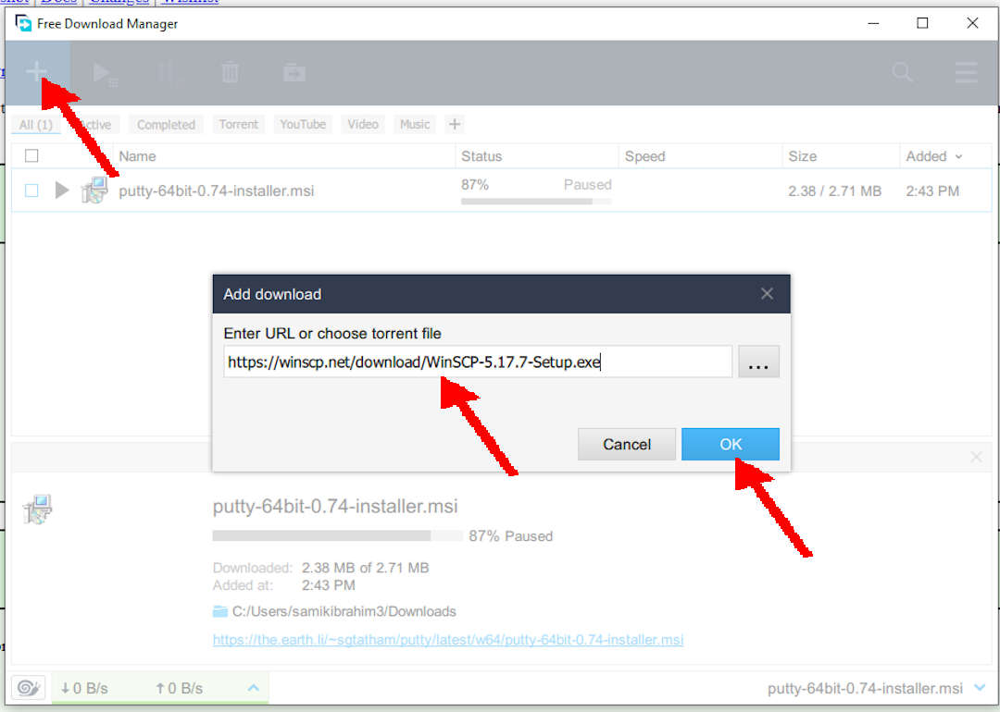
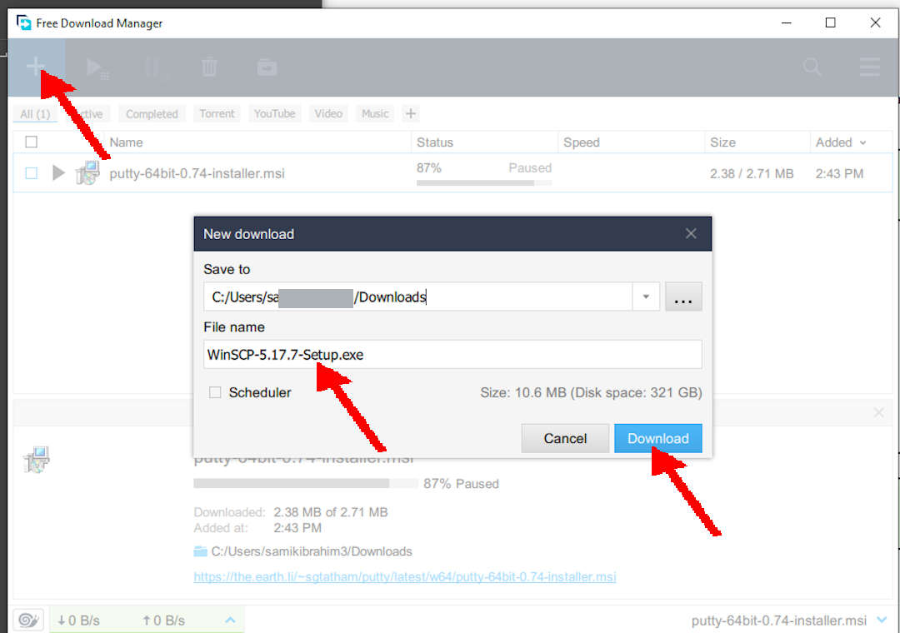
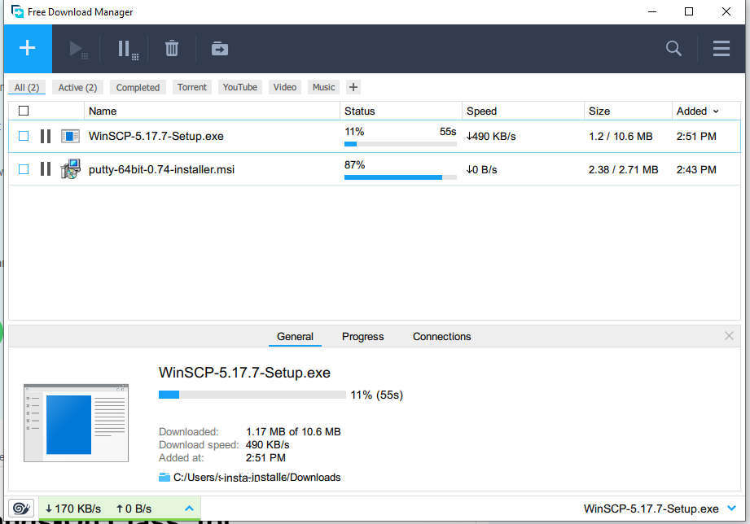
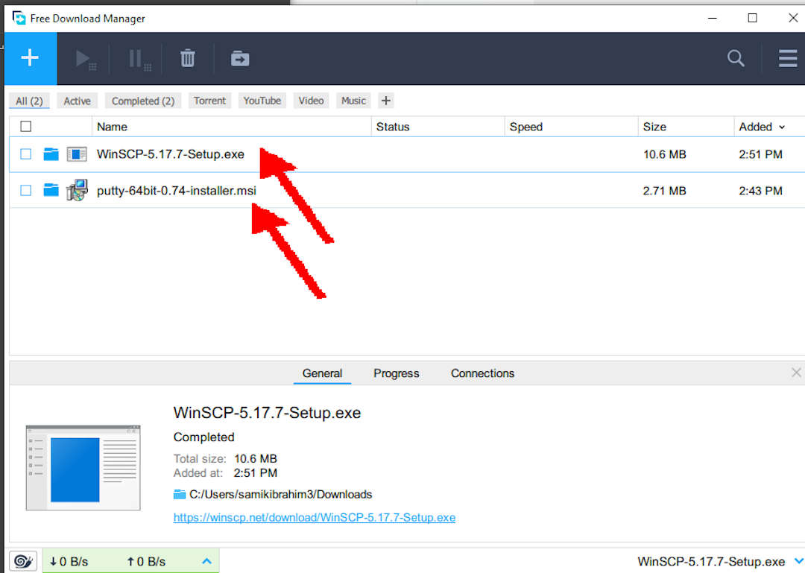

---
---

[HOME](index.md)
[ABOUT](README.md)
[WEB](https://osp4diss.vlsm.org/)
[GITHUB](/https://github.com/os2xx/osp4diss)
[TOP](#)
[BOTTOM](#endofpage)
[PREV](InstallVirtualBox.md)
[NEXT](index.md)

# Downloading PUTTY and WINSCP

### See also [FDM: Free Download Manager (Optional)](http://localhost:4000/InstallFDM.html)

 
## Downloading PUTTY

### PUTTY URL: [https://www.chiark.greenend.org.uk/~sgtatham/putty/latest.html](https://www.chiark.greenend.org.uk/~sgtatham/putty/latest.html)

### NOTE: The current version is PUTTY 0.76
#### THIS IS SUBJECT TO CHANGE! In this example, the version is 0.74

* Free Download Manager

 
## Downloading WINSCP

### WinSCP URL: [https://winscp.net/eng/download.php](https://winscp.net/eng/download.php)

* Check it out for the latest WINSCP version.
* In this example, the version is WinSCP 5.17

* Free Download Manager

* ZZZ... waiting...

* Done

  

[HOME](index.md)
[ABOUT](README.md)
[WEB](https://osp4diss.vlsm.org/)
[GITHUB](/https://github.com/os2xx/osp4diss)
[TOP](#)
[BOTTOM](#endofpage)
[PREV](InstallVirtualBox.md)
[NEXT](index.md)
 

