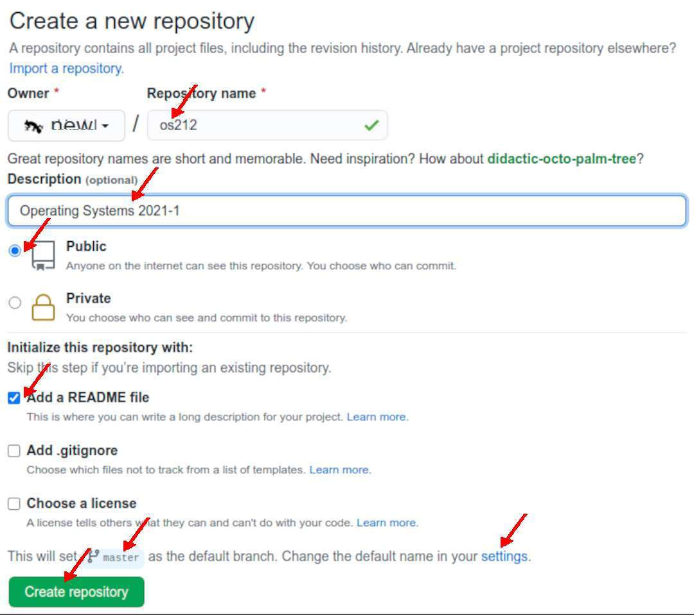

---
---
[HOME](index.md)
[ABOUT](README.md)
[WEB](https://osp4diss.vlsm.org/)
[GITHUB](https://github.com/os2xx/osp4diss/)
[TOP](#)
[BOTTOM](#endofpage)
[PREV](AOS.md#idx00)
[NEXT](W00-02.md)

# OS Week 00 Assignment #1: GitHub Account

* This is neither programming nor a web course.
  However, assignments will be submitted to GitHub and will be displayed on GitHub Page.
* Visit <https://github.com>:
  * SIGN UP, if you have no account: (<https://github.com/join/>).
    Preferably, use all lower case characters for your GitHub account.
  * Else, SIGN IN: (<https://github.com/login/>)

  
## Create a new Repository
  * Repository name, e.g:
    * "os221" for year 2022-1 (even semester 2021/2022),
    * "os222" for year 2022-2 (odd semester 2022/2023),
    * "os231" for year 2023-1 (even semester 2022/2023),
    * "os232" for year 2023-2 (odd semester 2022/2023),
    * etc.
    * Note: For "os" use lowercase. Do not use uppercase!
  * **Description**: (e.g.) Operating Systems 2022-1 (Odd Semester 21/22).
  * **Public**: Anyone can see this repository.
  * A simple **README.md** file.
  * This 
    following is an example from the previous year (os212)

  

  
## Default Branch

* The GitHub Default Branch Name Is Now "main"
  * To be "politically correct," GitHub has changed the default branch
    name from ”master” to ”main.”
  * Many past examples here have been using the "master" branch name.
  * Therefore -- for being consistent -- the "master" branch name will
    continue to be used.
  * Feel free to use either "main" or "master." However, once it has been
    chosen, you should not alter your branch name.
  * To change the default branch name, click "settings."

  
[HOME](index.md)
[ABOUT](README.md)
[WEB](https://osp4diss.vlsm.org/)
[GITHUB](https://github.com/os2xx/osp4diss)
[TOP](#)
[BOTTOM](#endofpage)
[PREV](AOS.md#idx00)
[NEXT](W00-02.md)
 

