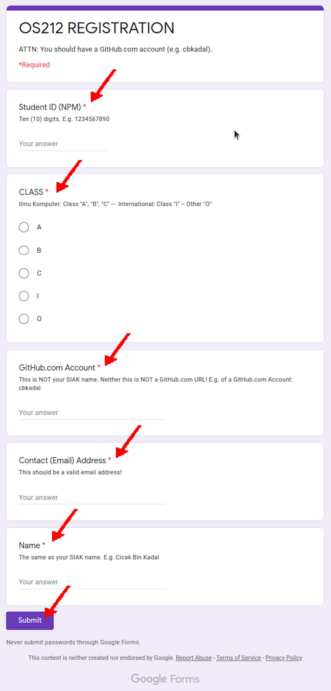

---
---
[HOME](index.md)
[ABOUT](README.md)
[WEB](https://osp4diss.vlsm.org/)
[GITHUB](/https://github.com/os2xx/osp4diss)
[TOP](#)
[BOTTOM](#endofpage)
[PREV](W00-03.md)
[NEXT](W00-05.md)

# Week 00 Assignment #4: Course Registration

* You should have a [GitHub.com](https://github.com/) account.
* First,
  you need to log in (login) with your university SSO account by visiting:
  <https://accounts.google.com/> (SSO UI).
* Next, visit the Google Form 
  ([see SCELE](https://scele.cs.ui.ac.id/mod/forum/discuss.php?d=34802)) 
  and fill the following information into the Google Form:
  * Student ID (NPM)
  * Class
  * GitHub.com Account
    * GitHub Account example: "cbkadal".
    * "github.com/cbkadal/" is not a GitHub account.
  * Email contact
    * Fill in with the email address that you normally use.
  * Your Full (SIAK) Name:
* E.g., os212 (last semester)

  

* You need to a Google Account to fill this Google Form.
The Google Form link will be available at
SCELE.
Fill in with the email address that you
normally use. It does not have to be Gmail.
GitHub Account example: ”cbkadal”.
”github.com/cbkadal/” is not a GitHub
account.
Use your SIAK name, NOT your NICK
name.
If you make a mistake, revisit the Google
Form page.
a
The form content is subject to change

  
[HOME](index.md)
[ABOUT](README.md)
[WEB](https://osp4diss.vlsm.org/)
[GITHUB](/https://github.com/os2xx/osp4diss)
[TOP](#)
[BOTTOM](#endofpage)
[PREV](W00-01.md)
[NEXT](W00-03.md)
 

