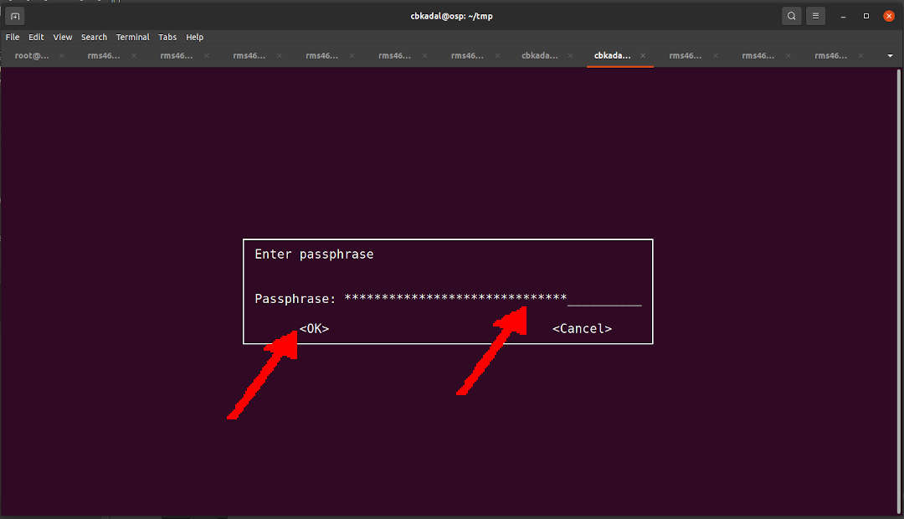

---
---

[HOME](index.md)
[ABOUT](README.md)
[WEB](https://osp4diss.vlsm.org/)
[GITHUB](https://github.com/os2xx/osp4diss/)
[TOP](#)
[BOTTOM](#endofpage)
[PREV](index.md#idx0704)
[NEXT](W04-01.md)

<br>
## Assignment Week 04 (eg. cbkadal) 

### Fetch and Extract File "WEEK04.tar.bz2.asc"

* Download <https://os.vlsm.org/WEEK/WEEK04.tar.bz2.asc>
* Choose a working directory (e.g. myweek04)

```
mkdir -pv $HOME/myweek04/
cd        $HOME/myweek04/
wget -c https://os.vlsm.org/WEEK/WEEK04.tar.bz2.asc

```

```
ZCZC 615033D6 AEB5E0DA
cbkadal@cbkadal:~$ mkdir -pv $HOME/myweek04/
mkdir: created directory '/home/cbkadal/myweek04/'

ZCZC 61503433 C7703C84
cbkadal@cbkadal:~$ cd        $HOME/myweek04/

ZCZC 61503433 C7703C84
cbkadal@cbkadal:~/myweek04$ wget -c https://os.vlsm.org/WEEK/WEEK04.tar.bz2.asc
--2021-09-26 15:49:55--  https://os.vlsm.org/WEEK/WEEK04.tar.bz2.asc
Resolving os.vlsm.org (os.vlsm.org)... 185.199.109.153, 185.199.108.153, 185.199.110.153, ...
Connecting to os.vlsm.org (os.vlsm.org)|185.199.109.153|:443... connected.
HTTP request sent, awaiting response... 200 OK
Length: 309238 (302K) [application/pgp-signature]
Saving to: ‘WEEK04.tar.bz2.asc’

WEEK04.tar.bz2.asc     100%[==================================>] 301.99K  1.75MB/s    in 0.2s    

2021-09-26 15:49:55 (1.75 MB/s) - ‘WEEK04.tar.bz2.asc’ saved [309238/309238]

ZCZC 61503433 C7703C84
cbkadal@cbkadal:~/myweek04$

```

<br>
* Decrypt "WEEK04.tar.bz2.asc" into tarball file "WEEK04.tar.bz2"
* Extract tarball "WEEK04.tar.bz2"

```
ls -al
gpg -o WEEK04.tar.bz2 -d WEEK04.tar.bz2.asc

```

```
ZCZC 61503634 6175924B
cbkadal@cbkadal:~/myweek04$ ls -al
total 312
drwxr-xr-x  2 cbkadal cbkadal   4096 Sep 26 15:55 .
drwxr-xr-x 18 cbkadal cbkadal   4096 Sep 26 15:54 ..
-rw-r--r--  1 cbkadal cbkadal 309238 Sep 26 15:42 WEEK04.tar.bz2.asc

ZCZC 61503636 A13222CD
cbkadal@cbkadal:~/myweek04$ gpg -o WEEK04.tar.bz2 -d WEEK04.tar.bz2.asc
```

<br>
* The "passphrase" will be announced on the weekly Zoom session.

<br>

<br>

```
gpg: AES256.CFB encrypted data
gpg: encrypted with 1 passphrase

ZCZC 6150364A 8E4D4186
cbkadal@cbkadal:~/myweek04$

```

```
ls -al
tar xf WEEK04.tar.bz2
ls -al

```

```
ZCZC 6150378E E4BCAD5B
cbkadal@cbkadal:~/myweek04$ ls -al
total 536
drwxr-xr-x  2 cbkadal cbkadal   4096 Sep 26 15:58 .
drwxr-xr-x 18 cbkadal cbkadal   4096 Sep 26 15:54 ..
-rw-r--r--  1 cbkadal cbkadal 228226 Sep 26 15:58 WEEK04.tar.bz2
-rw-r--r--  1 cbkadal cbkadal 309238 Sep 26 15:42 WEEK04.tar.bz2.asc

ZCZC 6150378F 0B4D4E64
cbkadal@cbkadal:~/myweek04$ tar xf WEEK04.tar.bz2

ZCZC 6150378F 0B4D4E64
cbkadal@cbkadal:~/myweek04$ ls -al
total 540
drwxr-xr-x  3 cbkadal cbkadal   4096 Sep 26 16:04 .
drwxr-xr-x 18 cbkadal cbkadal   4096 Sep 26 15:54 ..
drwxr-xr-x  3 cbkadal cbkadal   4096 Sep 26 15:39 WEEK04
-rw-r--r--  1 cbkadal cbkadal 228226 Sep 26 15:58 WEEK04.tar.bz2
-rw-r--r--  1 cbkadal cbkadal 309238 Sep 26 15:42 WEEK04.tar.bz2.asc

ZCZC 6150378F 0B4D4E64
cbkadal@cbkadal:~/myweek04$

```

<br id="endofpage"><br>

[HOME](index.md)
[ABOUT](README.md)
[WEB](https://osp4diss.vlsm.org/)
[GITHUB](https://github.com/os2xx/osp4diss)
[TOP](#)
[BOTTOM](#endofpage)
[PREV](index.md#idx0704)
[NEXT](W04-01.md)
<br>

