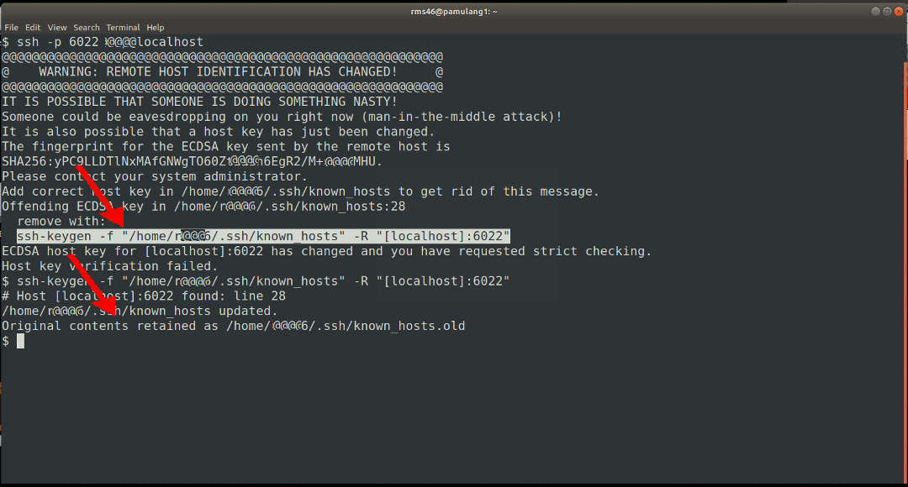
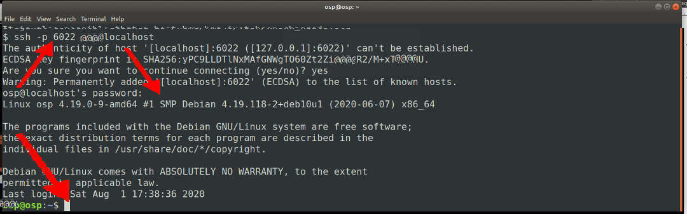

---
---

[HOME](index.md)
[ABOUT](README.md)
[WEB](https://osp4diss.vlsm.org/)
[GITHUB](https://github.com/os2xx/osp4diss)
[TOP](#)
[BOTTOM](#endofpage)
[PREV](osp-002-putty.md)
[NEXT](osp-002-winscp.md)

<br>
## SSH from a GNU/Linux HOST

```
ssh -p 6022 cbkadal@localhost
# REMOVE THE OLD KEY
ssh-keygen -f ~/.ssh/known_hosts -R "[localhost]:6022"

```



```
# ONE MORE TIME
ssh -p 6022 cbkadal@localhost

```



<br id="endofpage"><br>

[HOME](index.md)
[ABOUT](README.md)
[WEB](https://osp4diss.vlsm.org/)
[GITHUB](https://github.com/os2xx/osp4diss)
[TOP](#)
[BOTTOM](#endofpage)
[PREV](osp-002-putty.md)
[NEXT](osp-002-winscp.md)
<br>

